# AI3001 Artificial Intelligence: Exam-Oriented Study Guide

This guide is built only from the supplied syllabus, PPTs, PDFs, DOCX notes, and visible PYQ pages in the folder. Duplicate copies like `(1)` were treated as duplicates, not separate sources.

> [!IMPORTANT]
> This file is designed for GitHub Markdown. GitHub renders Mermaid diagrams inside fenced `mermaid` blocks, so the flowcharts below should display directly after upload.

## Source Map

Core files used:

- `syllabus.pdf`
- `intelligent agents.ppt`
- `PROBLEM-SOLVING.ppt`
- `HeuristicSearch.ppt`
- `AStar_example.ppt`
- `planning.ppt`
- `ai-4up-04-propositional-logic.pdf`
- `AIMA_ch7.pdf`
- `expert system.docx`
- `searching algos.docx`
- `state search space problems.docx`
- PYQs in `Previous Question Papers`

## How to Use This Guide

| If you have... | Best use of this guide |
|---|---|
| 1 day | Read the **Frequency Analysis**, **Quick Answer Templates**, and **Last-Day Revision Checklist** first. Then solve the **Practice Drill**. |
| 3 days | Study Units 1-6 in order, then revise the **Puzzle and Logic Deep-Dive** section. |
| 1 week | Use the syllabus breakdown for theory answers, then practice one PYQ-style puzzle type per day. |

### GitHub Visual Legend

| Symbol in guide | Meaning |
|---|---|
| **Must-Know** | Terms that should appear in exam answers. |
| **High Frequency** | Seen repeatedly in the visible PYQs. |
| **Exam Frame** | A ready structure for writing 5-mark or 10-mark answers. |
| `Shutterstock` placeholder | Use an external image here later if you want a polished visual in GitHub. |
| Mermaid diagrams | Built-in GitHub-rendered flowcharts for quick grasping. |

## One-Page Course Map

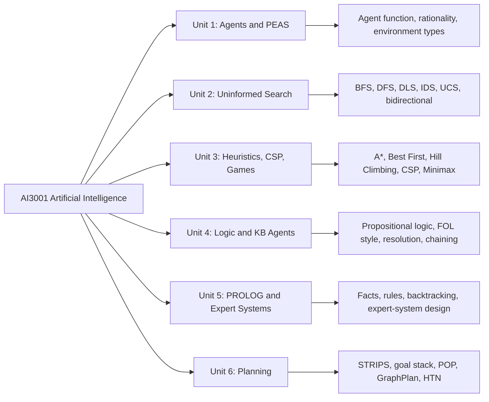

## Table of Contents

- [1. Syllabus Breakdown](#1-syllabus-breakdown)
  - [Unit 1: Fundamentals of Artificial Intelligence and Intelligent Agents](#unit-1-fundamentals-of-artificial-intelligence-and-intelligent-agents)
  - [Unit 2: Uninformed Search Strategies](#unit-2-uninformed-search-strategies)
  - [Unit 3: Informed Search, CSP, and Game Playing](#unit-3-informed-search-csp-and-game-playing)
  - [Unit 4: Logical Agents, Propositional Logic, and First-Order Style Reasoning](#unit-4-logical-agents-propositional-logic-and-first-order-style-reasoning)
  - [Unit 5: Basics of PROLOG and Expert Systems](#unit-5-basics-of-prolog-and-expert-systems)
  - [Unit 6: Planning](#unit-6-planning)
- [Must-Know Terms Explained](#must-know-terms-explained)
- [Syllabus Completeness Add-On](#syllabus-completeness-add-on)
- [2. PYQ Frequency Analysis](#2-pyq-frequency-analysis)
- [3. Exam Pattern by Syllabus Heading](#3-exam-pattern-by-syllabus-heading)
- [4. Puzzle and Logic Deep-Dive](#4-puzzle-and-logic-deep-dive)
- [5. Quick Answer Templates](#5-quick-answer-templates)
- [6. Practice Drill](#6-practice-drill)
- [7. Model Question Papers](#7-model-question-papers)
- [8. Last-Day Revision Checklist](#8-last-day-revision-checklist)

---

# 1. Syllabus Breakdown

## Unit 1: Fundamentals of Artificial Intelligence and Intelligent Agents

### Theory Focus

An **agent** is anything that perceives its environment through **sensors** and acts on that environment through **actuators**. In the slides, a human agent uses eyes, ears, hands, legs, and speech organs; a robotic agent uses cameras, infrared range finders, motors, and similar physical devices. The key exam idea is that AI is studied as an interaction loop: percepts enter the agent, the agent program chooses actions, and the actions affect the environment.

The **agent function** maps percept histories to actions:

$$
f: P^* \to A
$$

The **agent program** is the implementation that runs on a physical architecture. Hence:

$$
\text{agent} = \text{architecture} + \text{program}
$$

A **rational agent** chooses the action expected to maximize its **performance measure**, using its percept sequence and built-in knowledge. Rationality is not omniscience. The agent does not know everything; it acts based on available evidence. A rational agent may perform **information gathering** actions to improve future percepts. An agent is **autonomous** when its behavior depends on its own experience and it can learn or adapt.

**PEAS** is a standard way to specify an agent task: **Performance measure, Environment, Actuators, Sensors**. For example, an automated taxi has performance measures like safe, fast, legal, comfortable trip and profit; its environment includes roads, traffic, pedestrians, and customers; its actuators include steering, accelerator, brake, signal, and horn; and its sensors include cameras, sonar, speedometer, GPS, odometer, and engine sensors. PYQs repeatedly ask PEAS for new domains such as grocery shelf stocking robots and medical diagnosis systems.

The **task environment** determines the agent design. Slides classify environments as fully observable or partially observable, deterministic or stochastic, episodic or sequential, static or dynamic, discrete or continuous, and single-agent or multi-agent. Real-world environments are usually partially observable, stochastic, sequential, dynamic, continuous, and multi-agent.

Agent types are listed in increasing generality: **simple reflex agents**, **model-based reflex agents**, **goal-based agents**, **utility-based agents**, and **learning agents**. A simple reflex agent reacts directly to current percepts, while a model-based reflex agent maintains internal state. A goal-based agent chooses actions that help achieve a goal, a utility-based agent evaluates the desirability of outcomes, and a learning agent improves through experience.

### Visual: Agent-Environment Cycle

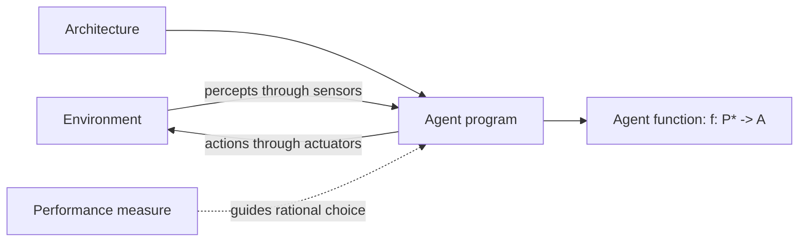

### Exam Frame: How to Write an Agent Answer

For a 5-mark answer, write the definition first, then connect it to the domain asked in the question. A strong answer should mention **percepts**, **actions**, **sensors**, **actuators**, and **performance measure**. If the question gives a specific agent, do not write only generic theory; map each abstract term to the given example.

For a 10-mark answer, add PEAS and environment classification. For example, a robot rolling a die uses cameras as sensors, a gripper/arm as actuators, die position and face orientation as percepts, and actions such as grip, twist, release, or adjust force. Its environment is usually partially observable if the camera cannot capture all physical details, stochastic because the die roll has uncertainty, sequential because earlier actions affect later state, dynamic if the die is moving during decision-making, and continuous in physical force/position even if the target die face is discrete.

### PEAS Answer Pattern

| PEAS Item | What to write | Example: Grocery Shelf-Stocking Robot |
|---|---|---|
| Performance measure | What counts as success | Correct shelves filled, fewer misplaced items, less time, safe operation |
| Environment | Where the agent operates | Store aisles, shelves, products, customers, workers, other robots |
| Actuators | How it acts | Wheels, robotic arm, gripper, display/speaker |
| Sensors | How it perceives | Cameras, barcode reader, weight sensors, proximity sensors |

```text
Shutterstock
Diagram placeholder: agent-environment loop showing sensors, percepts, agent program, actuators, and actions.
```

### Must-Know Terms

**Agent**, **sensor**, **actuator**, **agent function**, **agent program**, **architecture**, **rational agent**, **performance measure**, **autonomy**, **PEAS**, **task environment**, **simple reflex agent**, **model-based reflex agent**, **goal-based agent**, **utility-based agent**, **learning agent**.

---

## Unit 2: Uninformed Search Strategies

### Theory Focus

A problem-solving agent formulates a **goal**, defines a **problem**, searches for an action sequence, and executes the actions. A well-defined problem has four components: **initial state**, **actions/successor function**, **goal test**, and **path cost function**. This structure is used in almost every search PYQ, even when the question is disguised as a maze, route map, puzzle, or robot domain.

The slides identify common toy and real-world problems: **vacuum world**, **8-puzzle**, **8-queens**, **route finding**, and **knapsack**. A search tree is generated by expanding nodes from the initial state according to available actions. Search algorithms are evaluated by **completeness**, **optimality**, **time complexity**, and **space complexity**.

**Breadth-First Search (BFS)** expands the shallowest unexpanded node first. It is complete when the branching factor is finite. It is optimal when all step costs are equal because it finds the shallowest solution. Its weakness is memory: it stores all frontier nodes, so space complexity grows exponentially.

**Depth-First Search (DFS)** expands deepest nodes first. Its main advantage is low memory usage, but it can fail in infinite-depth spaces or spaces with loops. It is not generally complete and not optimal. A common exam point is that DFS may need a visited set or path-checking to avoid cycling.

**Depth-Limited Search (DLS)** is DFS with a fixed depth limit. It is guaranteed to stop, but it misses solutions deeper than the limit. **Iterative Deepening Search (IDS)** repeatedly runs DLS with increasing limits: 0, 1, 2, and so on. It combines the low memory of DFS with the optimality of BFS when costs are unit costs.

**Uniform-Cost Search (UCS)** expands the node with the lowest path cost \(g(n)\). It is complete and optimal when step costs are at least a positive \(\epsilon\). BFS is a special case of UCS when all step costs are equal.

**Bidirectional Search** searches forward from the initial state and backward from the goal until the two searches meet. It can reduce time from \(O(b^l)\) to approximately \(O(b^{l/2})\), but it needs reversible operators, manageable goal states, and a way to check whether the two frontiers meet.

### Visual: General Problem-Solving Agent

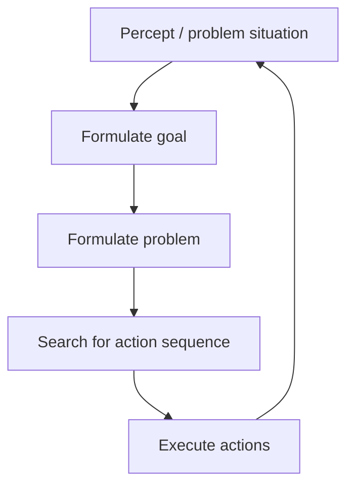

### Visual: Search Strategy Expansion Styles

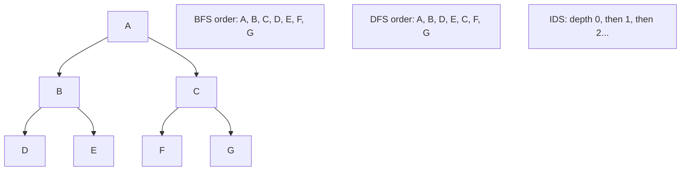

### Search Strategy Comparison

| Strategy | Complete? | Optimal? | Key Exam Note |
|---|---:|---:|---|
| BFS | Yes, if \(b\) finite | Yes, if unit cost | Expands level by level |
| DFS | No in infinite/loop spaces | No | Low memory but can get stuck |
| DLS | No, unless solution within limit | No | Stops at fixed depth |
| IDS | Yes | Yes, if unit cost | BFS result with DFS-like memory |
| UCS | Yes, if costs \(>= \epsilon\) | Yes | Expands lowest \(g(n)\) |
| Bidirectional | Yes with complete half-searches | Yes for unit cost | Meets in the middle |

### Expanded Comparison for 10-Mark Answers

| Strategy | Frontier behavior | Time | Space | Best use |
|---|---|---:|---:|---|
| BFS | FIFO queue | \(O(b^l)\) | \(O(b^l)\) | Shortest path when every step has cost 1 |
| DFS | Stack / recursion | \(O(b^m)\) | \(O(bm)\) | Memory-limited search, many deep solutions |
| DLS | DFS with depth limit \(d\) | \(O(b^d)\) | \(O(bd)\) | When maximum useful depth is known |
| IDS | Repeated DLS | \(O(b^l)\) | \(O(bl)\) | Unknown depth with unit costs |
| UCS | Priority queue by \(g(n)\) | Nodes with \(g \le C^*\) | Same as frontier | Weighted shortest path |
| Bidirectional | Two frontiers | \(O(b^{l/2})\) | \(O(b^{l/2})\) | Reversible actions and clear goal state |

> [!NOTE]
> In PYQs, "show the order of node expansion" usually means list the node when it is removed from OPEN/frontier for expansion, not merely when it is generated.

```text
Shutterstock
Diagram placeholder: same tree expanded by BFS, DFS, and IDS with colored expansion order.
```

### Must-Know Terms

**Initial state**, **successor function**, **goal test**, **path cost**, **search tree**, **frontier/open list**, **closed list**, **completeness**, **optimality**, **branching factor**, **solution depth**, **BFS**, **DFS**, **DLS**, **IDS**, **UCS**, **bidirectional search**.

---

## Unit 3: Informed Search, CSP, and Game Playing

### Theory Focus: Heuristic Search

A **heuristic function** estimates the cheapest cost from a node to a goal:

$$
h(n) \approx h^*(n)
$$

In the slides, examples include the number of misplaced tiles in the 8-puzzle, sum of Manhattan distances in the 8-puzzle, Manhattan distance in grid navigation, and straight-line distance in route search. A good heuristic guides search toward promising nodes, but the time spent computing it must be recovered by reduced search effort.

**Greedy Best-First Search** orders the frontier by \(h(n)\). It often expands fewer nodes but is not generally optimal. It can be incomplete in infinite spaces or when repeated states are not handled.

**A\*** combines UCS and Greedy Best-First Search:

$$
f(n) = g(n) + h(n)
$$

Here, \(g(n)\) is the cost so far, \(h(n)\) is the estimated cost to the goal, and \(f(n)\) estimates the cost of a solution through \(n\). A* is complete and optimal when the heuristic is admissible and step costs are positive.

A heuristic is **admissible** if it never overestimates the true remaining cost:

$$
0 \le h(n) \le h^*(n)
$$

A heuristic is **consistent** if:

$$
h(n) \le c(n,n') + h(n')
$$

Consistency implies that \(f(n)\) values along a path are non-decreasing, and when A* expands a node, it has found the optimal path to that state. The slides also note that \(h(n)=0\) reduces A* to BFS/UCS behavior, and a more informed heuristic dominates a weaker one when both are admissible and consistent.

**IDA\*** performs depth-first iterations using a cutoff on \(f(n)\). It uses less memory than A* but repeats work across iterations.

### Theory Focus: Hill Climbing and Generate-and-Test

**Generate-and-test** produces candidate states and checks whether they satisfy the goal. **Hill climbing** moves from the current state to a neighbor with a better heuristic value. It is simple but can get stuck at local maxima/minima, plateaus, or ridges. PYQs use hill climbing in numeric functions and grid/maze problems.

### Theory Focus: Constraint Satisfaction Problems

A **CSP** is solved by assigning values to variables under constraints. The PYQs repeatedly use map coloring, seating arrangements, and puzzle constraints. The standard strategy is **backtracking search** with heuristics:

- **MRV / LRV**: choose the variable with the fewest legal values.
- **MCV / degree heuristic**: choose the variable involved in the most constraints.
- **LCV**: choose the value that rules out the fewest options for neighbors.
- **Forward checking**: after an assignment, remove inconsistent values from neighboring variables.

### Theory Focus: Game Playing

In two-player deterministic games, **minimax** assumes both players play optimally. MAX chooses the move with the highest backed-up value, while MIN chooses the lowest. **Alpha-beta pruning** removes branches that cannot affect the final minimax value. It does not change the final minimax answer; it only avoids unnecessary computation.

For multi-player games, the PYQs mention a variant where leaf nodes contain triples such as \((f_A(n), f_B(n), f_C(n))\). Each player chooses the successor that maximizes that player’s component of the tuple.

### Visual: A* Decision Flow

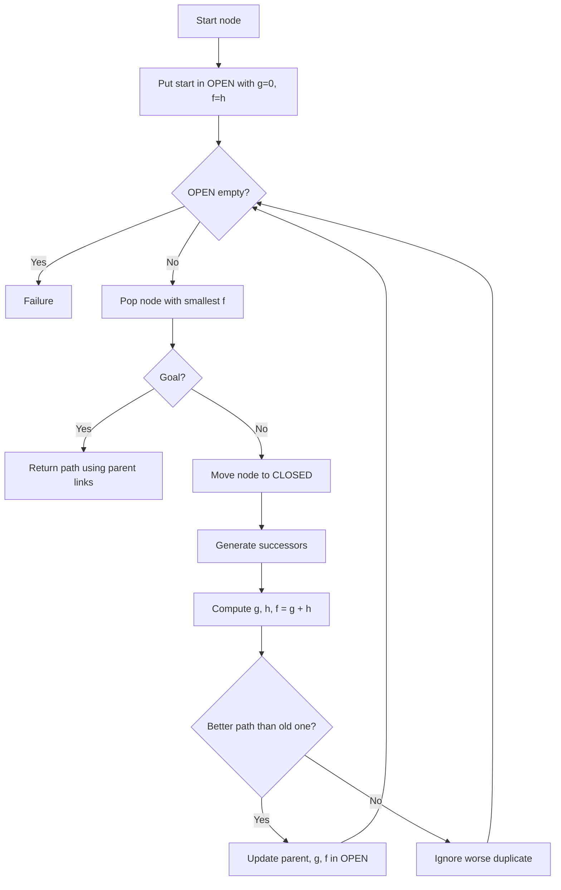

### Visual: CSP Backtracking Flow

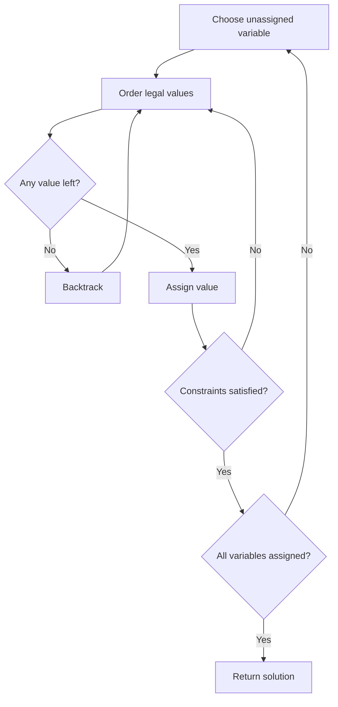

### Visual: Minimax and Alpha-Beta

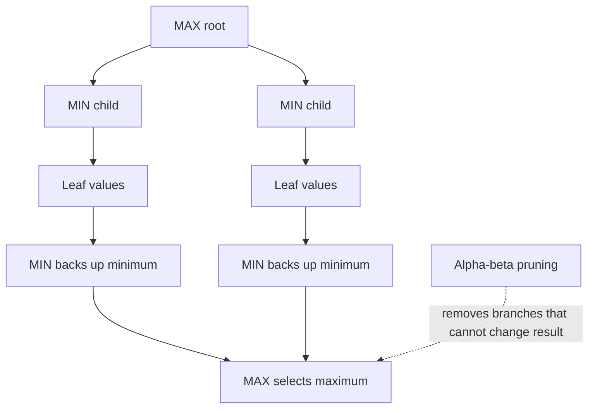

### Exam Frame: How to Present A* in PYQs

When a PYQ says "show all steps with open and closed list," use a table. Each row should contain **expanded node**, **generated nodes with \(g,h,f\)**, **OPEN after sorting**, and **CLOSED**. The most common mistake is stopping when the goal is generated. For A*, stop when the goal is selected for expansion from OPEN.

### Exam Frame: How to Present CSP in PYQs

Start with variables and domains. Then write constraints. If the question mentions alphabetical order or lower-numbered seats, obey that exact order. If the question mentions MRV, MCV, or LCV, explicitly state which variable/value the heuristic selects and why.

### Exam Frame: How to Present Game Trees

For minimax, write terminal values first, then backed-up values from bottom to top. For alpha-beta, show \(\alpha\) and \(\beta\) updates and mark the first point where \(\alpha \ge \beta\). Always state that pruning does not change the final minimax value.

```text
Shutterstock
Diagram placeholder: A* open/closed list on a weighted graph, plus a minimax tree with alpha-beta cuts.
```

### Must-Know Terms

**Heuristic**, **Greedy Best-First Search**, **A\***, **\(g(n)\)**, **\(h(n)\)**, **\(f(n)\)**, **admissible heuristic**, **consistent heuristic**, **dominance**, **IDA\***, **hill climbing**, **local maximum**, **plateau**, **CSP**, **backtracking**, **MRV/LRV**, **MCV**, **LCV**, **forward checking**, **minimax**, **alpha-beta pruning**, **MAX**, **MIN**, **quiescence**.

---

## Unit 4: Logical Agents, Propositional Logic, and First-Order Style Reasoning

### Theory Focus

The logical-agent slides motivate **knowledge representation**: instead of hardcoding every application, we specify rules and use an inference engine. The **Wumpus World** is the main example. The agent starts in \((1,1)\), which is safe, and must get the gold while avoiding pits and the Wumpus. It receives percepts such as stench, breeze, glitter, bump, and scream.

A **knowledge base (KB)** stores sentences that represent facts and rules. An **inference procedure** derives new true sentences from existing sentences. **Entailment** means:

$$
KB \models \alpha
$$

That is, whenever the KB is true, \(\alpha\) must also be true. The slides explain entailment both through models and through inference rules. A good inference engine should be **truth-preserving** and **complete**.

In **propositional logic**, atomic formulas are propositions with truth values true or false. Complex formulas use connectives such as \(\neg\), \(\land\), \(\lor\), \(\to\), and \(\leftrightarrow\). A formula is **valid** if true under every assignment, **satisfiable** if true under at least one assignment, and **unsatisfiable/contradictory** if true under no assignment. Exhaustive model checking over \(n\) symbols has complexity \(O(2^n)\).

**CNF** represents a sentence as a conjunction of clauses. A clause is a disjunction of literals. Resolution is applied to clauses. The resolution refutation method proves \(KB \models \alpha\) by proving:

$$
KB \land \neg \alpha
$$

is unsatisfiable. The steps are: convert \(KB \land \neg \alpha\) to CNF, repeatedly apply resolution, and stop when the empty clause is derived or no new clauses can be produced.

The source notes define **Horn clauses** as clauses with at most one positive literal. Horn clauses can be written as implications:

$$
(A_1 \land A_2 \land \cdots \land A_k) \to B
$$

Inference in Horn clauses can be done using **forward chaining** and **backward chaining** efficiently. Forward chaining is data-driven: start with known facts and fire rules whose premises are satisfied. Backward chaining is goal-driven: start with a query and recursively prove its subgoals.

The syllabus also lists **First Order Logic**. In the PYQs, FOL appears as English-to-predicate-logic and resolution questions. The safe exam method is: define predicates, constants, and variables; translate each English sentence with quantifiers; convert to clauses when resolution is asked; add the negation of the goal; then resolve to contradiction.

### Visual: Logical Agent Pipeline

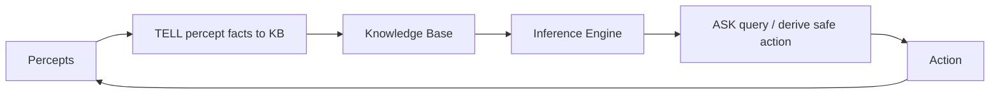

### Visual: Resolution Refutation

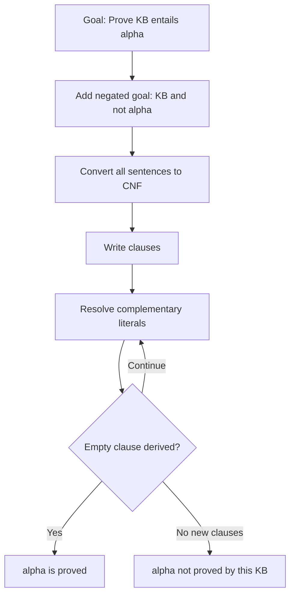

### Key Logic Conversions

| English / connective | Logic form | CNF-useful form |
|---|---|---|
| Not \(P\) | \(\neg P\) | \(\neg P\) |
| \(P\) and \(Q\) | \(P \land Q\) | Already conjunctive |
| \(P\) or \(Q\) | \(P \lor Q\) | Clause |
| If \(P\), then \(Q\) | \(P \to Q\) | \(\neg P \lor Q\) |
| \(P\) iff \(Q\) | \(P \leftrightarrow Q\) | \((\neg P \lor Q) \land (\neg Q \lor P)\) |

### Exam Frame: Predicate-Logic Resolution

For FOL-style PYQs such as "Raj will pass AI" or "Scrooge is not a child," use this flow:

1. Define predicates and constants.
2. Translate each sentence into quantified logic.
3. Remove implications.
4. Push negations inward.
5. Standardize variables if needed.
6. Convert to clauses.
7. Add negation of the conclusion.
8. Resolve until contradiction.

> [!NOTE]
> In the visible PYQs, full FOL machinery is usually tested through practical translation and resolution, not through long theoretical proofs of unification or Skolemization.

```text
Shutterstock
Diagram placeholder: Wumpus World grid with stench/breeze percepts and inferred safe/unsafe squares.
```

### Must-Know Terms

**Knowledge base**, **logical agent**, **Wumpus World**, **entailment**, **model**, **truth-preserving inference**, **complete inference**, **propositional symbol**, **literal**, **clause**, **CNF**, **DNF**, **validity**, **satisfiability**, **contradiction**, **resolution**, **empty clause**, **Horn clause**, **forward chaining**, **backward chaining**, **predicate**, **quantifier**.

---

## Unit 5: Basics of PROLOG and Expert Systems

### Theory Focus

An **expert system** is an AI program that imitates the decision-making ability of a human expert in a specialized domain. It uses a **knowledge base** and an **inference engine** to make recommendations, diagnoses, or decisions.

The main components are:

- **Knowledge base**: facts, rules, frames, or semantic-network style domain knowledge.
- **Inference engine**: applies rules using reasoning such as forward or backward chaining.
- **Working memory / fact base**: stores current facts about the specific case.
- **Explanation facility**: explains why a conclusion was reached.
- **User interface**: collects user input and displays conclusions.
- **Knowledge acquisition module**: helps add or modify expert knowledge.

PROLOG represents knowledge as **facts** and **rules**. A fact might be `fever(john).` and a rule might be `flu(X) :- fever(X), cough(X).` PROLOG uses backward chaining: when a query is asked, it attempts to prove the goal by proving subgoals. PROLOG also uses **unification** and **backtracking**, which makes it suitable for rule-based systems and CSP-style search.

PYQs ask expert-system design for medical diagnosis, network diagnosis, and admission guidance. For such questions, write a small domain, list symptoms/conditions as facts, write at least four rules, then explain how the inference engine reaches conclusions.

### Visual: Expert System Architecture

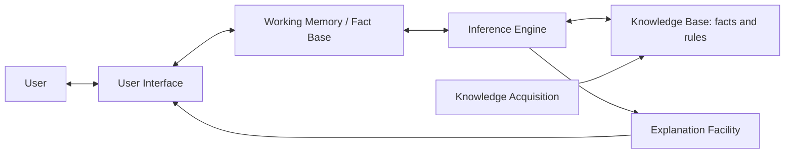

### Visual: PROLOG Backward Chaining

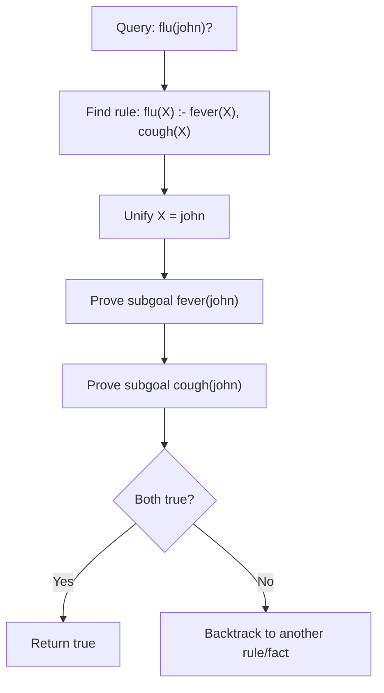

### Expert-System Rule Priority

When multiple rules are applicable, an expert system must decide which rule to fire first. PYQs ask this as "priority of rules in case of multiple applicable rules." An exam-safe answer is to mention **specificity**, **rule ordering**, **recency of facts**, **confidence/certainty**, and **domain priority**. For example, in medical diagnosis, a rule detecting emergency symptoms should fire before a general advice rule.

| Conflict case | Priority method | Example |
|---|---|---|
| Two rules match | Rule ordering | Fire rule written earlier or with higher assigned priority |
| One rule is more specific | Specificity | Fever + rash beats fever alone |
| Recent fact added | Recency | Use latest user symptom |
| Rules have certainty | Confidence factor | Choose higher certainty diagnosis |
| Safety-critical domain | Domain priority | Emergency rule before routine rule |

### Exam Frame: Designing an Expert System

For a 6-mark design question:

1. Name the domain.
2. List expected inputs/facts.
3. Write at least four rules.
4. Explain inference method.
5. Give one sample query and conclusion.
6. Add explanation facility if marks allow.

Example skeleton:

```prolog
slow_network(User) :- weak_signal(User), high_latency(User).
router_issue(User) :- no_connection(User), router_light_red(User).
dns_issue(User) :- internet_connected(User), website_not_resolving(User).
device_issue(User) :- other_devices_working(User), user_device_not_working(User).
```

### Must-Know Terms

**Expert system**, **knowledge base**, **inference engine**, **working memory**, **explanation facility**, **user interface**, **knowledge acquisition**, **PROLOG fact**, **PROLOG rule**, **query**, **unification**, **backtracking**, **assert**, **retract**.

---

## Unit 6: Planning

### Theory Focus

The planning slides begin by identifying limits of simple search: too many irrelevant actions, difficulty choosing good heuristics, and inability to exploit decomposition. A planner uses structured representations of states, goals, and actions so it can add actions where needed and connect them directly to goals.

**STRIPS** represents states as conjunctions of function-free ground literals. An action schema has three parts: action name/parameters, preconditions, and effects. For example:

$$
Action(Fly(p, from, to))
$$

Preconditions: plane and airport facts plus current location. Effects: remove old location and add new location. In exam answers, always separate **preconditions**, **add effects**, and **delete effects**.

There are two state-space planning directions:

- **Forward state-space search / progression planning** starts at the initial state and applies actions until the goal holds.
- **Backward state-space search / regression planning** starts from the goal and chooses relevant actions that could achieve desired literals.

**Goal stack planning** uses a stack of goals, subgoals, and actions. It is common in Blocks World PYQs. You push unsatisfied goals, push actions that can achieve them, then push their preconditions. When preconditions are satisfied, execute/pop the action and update the state.

**Partial Order Planning (POP)** keeps plans flexible using the principle of **least commitment**. A partial plan contains actions, ordering constraints, and causal links. A causal link records that one action provides a condition needed by another:

$$
A \xrightarrow{p} B
$$

A **threat** occurs when another action can delete \(p\) between \(A\) and \(B\). POP resolves threats using **promotion** or **demotion**:

- Promotion: put the threatening action after the consumer.
- Demotion: put the threatening action before the producer.

The planning slides also cover **planning graphs** and **GraphPlan**. A planning graph alternates proposition levels and action levels. It uses **mutex** relations to mark incompatible actions or propositions. GraphPlan grows the graph until goals are reachable and non-mutex, then searches backward for a valid plan.

The slides also mention **HTN planning**, where non-primitive tasks are decomposed into subtasks using reduction schemas. HTN planning repeatedly chooses a non-primitive task, expands it, resolves interactions, and backtracks if necessary.

### Visual: STRIPS Action Schema

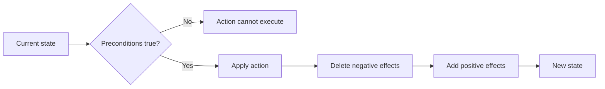

### Visual: Goal Stack Planning

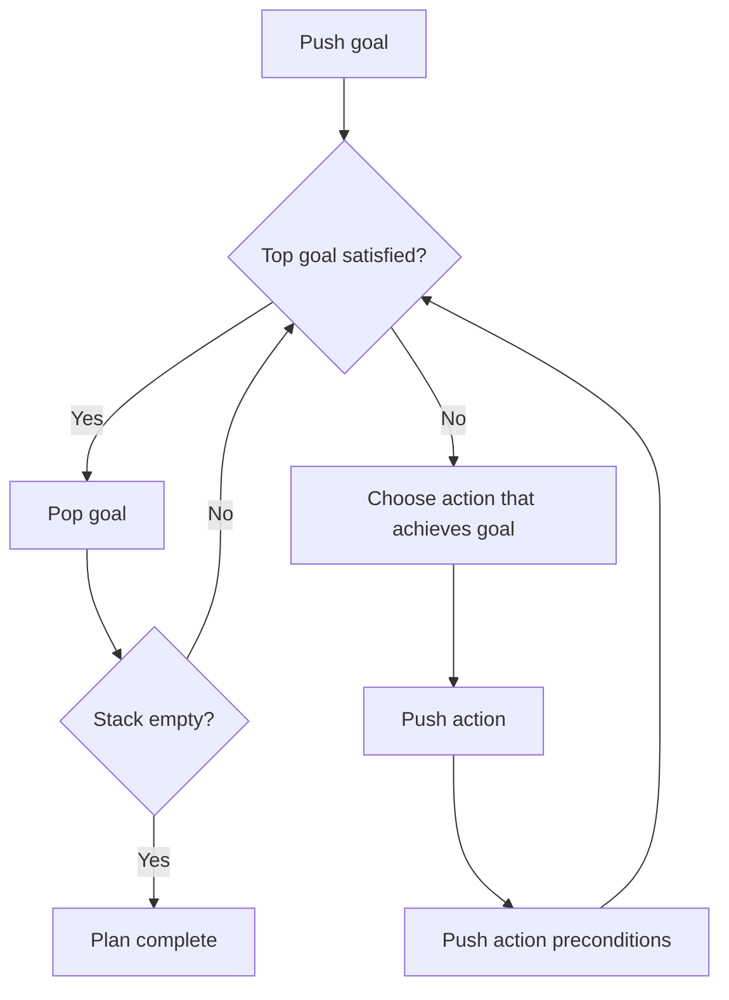

### Visual: POP Threat Resolution

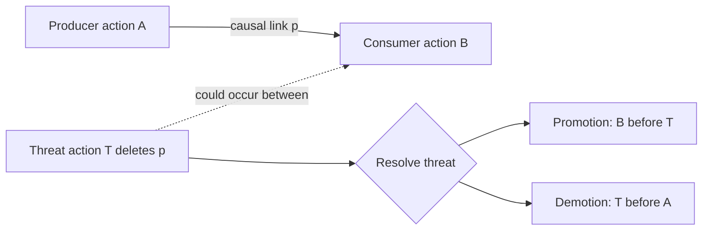

### Planning Techniques at a Glance

| Technique | Starts from | Main idea | PYQ-style use |
|---|---|---|---|
| Forward state-space planning | Initial state | Apply actions until goal holds | Simple robot/object movement |
| Backward state-space planning | Goal | Choose relevant actions that achieve goal literals | Regression reasoning |
| Goal stack planning | Goal stack | Push subgoals and actions | Blocks World |
| POP | Partial plan | Add actions only when needed; protect causal links | Threat identification |
| Planning graph / GraphPlan | Leveled graph | Use proposition/action levels and mutex | Theory explanation |
| HTN | High-level task | Decompose abstract tasks | Hierarchical domains |

### Limitations of Goal Stack Planning

Goal stack planning is easy to write in exams, but it can struggle when subgoals interact. In Blocks World, achieving one goal can undo another goal. This is the classic reason planning needs better handling of interactions. Goal stack planning also commits to an order early, while POP follows least commitment and delays ordering decisions until necessary.

```text
Shutterstock
Diagram placeholder: Blocks World goal-stack plan and POP causal links with a threat resolved by promotion/demotion.
```

### Must-Know Terms

**Planning**, **STRIPS**, **precondition**, **effect**, **add list**, **delete list**, **progression planning**, **regression planning**, **goal stack planning**, **Blocks World**, **POP**, **least commitment**, **causal link**, **threat**, **promotion**, **demotion**, **planning graph**, **mutex**, **GraphPlan**, **HTN planning**.

---

# Must-Know Terms Explained

Use this as a fast glossary before the exam. Each term has at least one exam-useful line so you can convert it directly into a definition answer.

## Unit 1 Glossary: Agents and Environments

| Term | Exam-ready meaning |
|---|---|
| **Agent** | An entity that perceives an environment through sensors and acts on it through actuators. |
| **Sensor** | A mechanism through which an agent receives information from the environment, such as a camera, keyboard, or speedometer. |
| **Actuator** | A mechanism through which an agent performs actions, such as a motor, screen display, brake, robotic arm, or gripper. |
| **Percept** | The input received by an agent at a particular instant through its sensors. |
| **Percept sequence** | The complete history of percepts received by an agent so far. |
| **Agent function** | A mathematical mapping from percept histories to actions, written as \(f:P^* \to A\). |
| **Agent program** | The actual implementation that runs on the architecture and produces actions from percepts. |
| **Architecture** | The physical or computational platform on which the agent program runs. |
| **Rational agent** | An agent that chooses the action expected to maximize its performance measure using percept history and built-in knowledge. |
| **Performance measure** | The objective criterion used to judge whether the agent is successful. |
| **Autonomy** | The ability of an agent to base its behavior on its own experience rather than only on fixed built-in rules. |
| **PEAS** | A task specification format: Performance measure, Environment, Actuators, and Sensors. |
| **Task environment** | The external situation in which the agent operates; its properties strongly influence agent design. |
| **Fully observable** | The agent’s sensors provide complete access to the relevant state of the environment. |
| **Partially observable** | The agent receives incomplete or noisy information about the environment. |
| **Deterministic** | The next state is completely determined by the current state and the action taken. |
| **Stochastic** | The next state is uncertain even when the current state and action are known. |
| **Episodic** | Each decision is independent of previous decisions, so one episode does not affect the next. |
| **Sequential** | Current actions affect future states and future decisions. |
| **Static** | The environment does not change while the agent is deciding. |
| **Dynamic** | The environment may change while the agent is deciding. |
| **Discrete** | The environment has a limited set of distinct states, percepts, or actions. |
| **Continuous** | State, time, percepts, or actions vary over continuous ranges. |
| **Single-agent** | Only one agent is considered in the environment. |
| **Multi-agent** | Multiple agents interact, cooperate, or compete in the environment. |
| **Simple reflex agent** | An agent that selects actions using condition-action rules based only on the current percept. |
| **Model-based reflex agent** | An agent that maintains internal state to handle partially observable environments. |
| **Goal-based agent** | An agent that selects actions based on whether they help achieve a goal. |
| **Utility-based agent** | An agent that chooses among states/actions using a utility value representing desirability. |
| **Learning agent** | An agent that improves its behavior from experience using feedback or observed outcomes. |

## Unit 2 Glossary: Uninformed Search

| Term | Exam-ready meaning |
|---|---|
| **Initial state** | The starting state of the problem before any action is applied. |
| **Successor function** | A function that returns legal next states reachable from a current state using available actions. |
| **Action** | An operation that changes one state into another state. |
| **Goal test** | A test that checks whether a given state satisfies the goal condition. |
| **Path cost** | The numerical cost accumulated along a sequence of actions. |
| **Search tree** | A tree representation of possible action sequences from the initial state. |
| **Search node** | A node in the search tree, usually storing state, parent, action, depth, and path cost. |
| **Frontier / OPEN list** | The set of generated but not yet expanded nodes. |
| **CLOSED list** | The set of nodes or states already expanded. |
| **Completeness** | A search algorithm is complete if it finds a solution whenever one exists. |
| **Optimality** | A search algorithm is optimal if it always returns the least-cost solution. |
| **Branching factor** | The average number of successors generated per node, commonly denoted by \(b\). |
| **Solution depth** | The depth of the shallowest goal node, often denoted by \(l\) or \(d\). |
| **Maximum depth** | The deepest level in the search space, often denoted by \(m\). |
| **BFS** | Breadth-First Search expands the shallowest node first and is optimal for unit step costs. |
| **DFS** | Depth-First Search expands deepest nodes first and uses low memory but can fail in infinite or cyclic spaces. |
| **DLS** | Depth-Limited Search is DFS with a fixed depth limit. |
| **IDS** | Iterative Deepening Search repeatedly applies DLS with increasing depth limits. |
| **UCS** | Uniform-Cost Search expands the node with the smallest path cost \(g(n)\). |
| **Bidirectional search** | A search method that searches forward from the start and backward from the goal until frontiers meet. |
| **Repeated state** | A state reached more than once, which can waste time unless detected and pruned. |

## Unit 3 Glossary: Informed Search, CSP, and Games

| Term | Exam-ready meaning |
|---|---|
| **Heuristic** | A problem-specific estimate that guides search toward promising states. |
| **Heuristic function** | A function \(h(n)\) estimating the cheapest remaining cost from node \(n\) to a goal. |
| **Greedy Best-First Search** | An informed search that expands the node with the smallest \(h(n)\). |
| **A\*** | An informed search using \(f(n)=g(n)+h(n)\), combining path cost and heuristic estimate. |
| **\(g(n)\)** | The actual cost from the start node to node \(n\). |
| **\(h(n)\)** | The estimated cost from node \(n\) to a goal. |
| **\(f(n)\)** | The estimated total solution cost through node \(n\), computed as \(g(n)+h(n)\). |
| **Admissible heuristic** | A heuristic that never overestimates the true remaining cost: \(0 \le h(n) \le h^*(n)\). |
| **Consistent heuristic** | A heuristic satisfying \(h(n) \le c(n,n') + h(n')\) for every successor \(n'\). |
| **Dominance** | A heuristic \(h_2\) dominates \(h_1\) if it is always at least as informed while still admissible. |
| **IDA\*** | Iterative Deepening A* performs depth-first search with increasing \(f\)-cost cutoffs. |
| **Generate-and-test** | A method that generates candidate solutions and tests whether they satisfy the goal. |
| **Hill climbing** | A local search method that moves to a better neighboring state based on heuristic value. |
| **Local maximum/minimum** | A state better than its immediate neighbors but not necessarily globally best. |
| **Plateau** | A flat region of the search space where neighboring states have the same heuristic value. |
| **CSP** | A Constraint Satisfaction Problem consists of variables, domains, and constraints. |
| **Variable** | An unknown item in a CSP that must be assigned a value. |
| **Domain** | The set of possible values for a CSP variable. |
| **Constraint** | A rule restricting which combinations of variable assignments are allowed. |
| **Backtracking** | A depth-first CSP search that undoes assignments when constraints fail. |
| **MRV / LRV** | A heuristic that selects the variable with the fewest remaining legal values. |
| **MCV** | Most Constraining Variable selects the variable that constrains the largest number of other variables. |
| **LCV** | Least Constraining Value chooses the value that removes the fewest options from other variables. |
| **Forward checking** | A CSP pruning method that removes illegal values from neighbors after an assignment. |
| **Minimax** | A game-tree algorithm where MAX maximizes utility and MIN minimizes utility. |
| **Alpha-beta pruning** | A minimax optimization that removes branches that cannot affect the final decision. |
| **MAX** | The player or node level that chooses the maximum utility value. |
| **MIN** | The player or node level that chooses the minimum utility value. |
| **Quiescence** | A stable game position where evaluation is less likely to change abruptly due to immediate tactical moves. |
| **Waiting for quiescence** | Delaying evaluation until a game position becomes stable enough to evaluate reliably. |
| **AO\*** | A heuristic search method for AND-OR graphs where solutions may require satisfying multiple subproblems. |
| **Means-Ends Analysis** | A strategy that compares current state and goal state, then chooses operators that reduce the difference. |

## Unit 4 Glossary: Logic and Knowledge-Based Agents

| Term | Exam-ready meaning |
|---|---|
| **Knowledge base** | A collection of logical sentences representing facts and rules. |
| **Logical agent** | An agent that uses a knowledge base and inference to decide actions. |
| **Wumpus World** | A grid-world logical-agent example involving gold, pits, Wumpus, stench, and breeze percepts. |
| **Entailment** | \(KB \models \alpha\) means \(\alpha\) is true in every model where \(KB\) is true. |
| **Model** | An assignment of truth values that gives meaning to logical symbols. |
| **Truth-preserving inference** | An inference procedure that derives only conclusions logically entailed by the KB. |
| **Complete inference** | An inference procedure that can derive every sentence entailed by the KB. |
| **Propositional symbol** | An atomic statement that is either true or false. |
| **Literal** | A propositional symbol or its negation. |
| **Clause** | A disjunction of literals. |
| **CNF** | Conjunctive Normal Form: a conjunction of clauses. |
| **DNF** | Disjunctive Normal Form: a disjunction of conjunctions of literals. |
| **Validity** | A formula is valid if it is true under every possible assignment. |
| **Satisfiability** | A formula is satisfiable if it is true under at least one assignment. |
| **Contradiction** | A formula is contradictory or unsatisfiable if it is true under no assignment. |
| **Resolution** | An inference rule that derives a new clause by eliminating complementary literals. |
| **Empty clause** | The contradiction derived in resolution, proving unsatisfiability. |
| **Horn clause** | A clause with at most one positive literal. |
| **Forward chaining** | Data-driven reasoning that starts from known facts and applies rules to derive conclusions. |
| **Backward chaining** | Goal-driven reasoning that starts from a query and tries to prove its required subgoals. |
| **Predicate** | A relation or property used in predicate logic, such as `Student(x)` or `Loves(x,y)`. |
| **Quantifier** | A logical operator such as universal \(\forall\) or existential \(\exists\). |

## Unit 5 Glossary: PROLOG and Expert Systems

| Term | Exam-ready meaning |
|---|---|
| **Expert system** | An AI program that imitates expert decision-making in a specialized domain. |
| **Inference engine** | The reasoning component that applies rules to facts to reach conclusions. |
| **Working memory** | The temporary store of facts about the current case or problem instance. |
| **Explanation facility** | The component that explains how or why a conclusion was reached. |
| **User interface** | The part through which users enter information and receive advice or conclusions. |
| **Knowledge acquisition** | The process of obtaining and updating expert knowledge for the system. |
| **PROLOG fact** | A basic assertion such as `fever(john).` |
| **PROLOG rule** | A conditional statement such as `flu(X) :- fever(X), cough(X).` |
| **Query** | A question asked to PROLOG, such as `?- flu(john).` |
| **Unification** | The process of matching terms by finding variable substitutions. |
| **PROLOG backtracking** | The process of returning to earlier choice points to try alternative facts or rules. |
| **assert** | A PROLOG operation for adding a fact/rule dynamically. |
| **retract** | A PROLOG operation for removing a fact/rule dynamically. |
| **Rule priority** | A conflict-resolution method used when multiple expert-system rules can fire. |

## Unit 6 Glossary: Planning

| Term | Exam-ready meaning |
|---|---|
| **Planning** | Constructing a sequence or partial order of actions that achieves a goal. |
| **STRIPS** | A planning representation using action schemas with preconditions and effects. |
| **Precondition** | A condition that must be true before an action can be executed. |
| **Effect** | A condition made true or false after an action executes. |
| **Add list** | The positive effects made true by an action. |
| **Delete list** | The facts made false by an action. |
| **Progression planning** | Forward state-space planning from initial state to goal. |
| **Regression planning** | Backward planning from goal conditions to required previous conditions. |
| **Goal stack planning** | A planning method that uses a stack of goals, subgoals, and actions. |
| **Blocks World** | A classic planning domain involving stacking and moving blocks. |
| **POP** | Partial Order Planning, which keeps action ordering flexible until constraints require it. |
| **Least commitment** | The principle of postponing decisions about order or bindings until necessary. |
| **Causal link** | A relation showing that one action establishes a condition needed by another action. |
| **Threat** | An action that may delete a condition protected by a causal link. |
| **Promotion** | Resolving a threat by ordering the threatening action after the consumer action. |
| **Demotion** | Resolving a threat by ordering the threatening action before the producer action. |
| **Planning graph** | A leveled graph of propositions and actions used to constrain planning search. |
| **Mutex** | A mutual exclusion relation showing that two actions or propositions cannot both hold in a valid plan at a level. |
| **GraphPlan** | A planning algorithm that grows a planning graph and searches it backward for a valid plan. |
| **HTN planning** | Hierarchical Task Network planning, where high-level tasks are decomposed into subtasks. |
| **Conditional planning** | Planning that includes branches for different possible conditions or outcomes. |
| **Continuous planning** | Planning that continues during execution and adapts when the world changes. |

---

# Syllabus Completeness Add-On

This section fills syllabus topics that are listed in the syllabus but can be easy to miss in revision.

## AO* Algorithm

**AO\*** is used for **AND-OR graphs**. An OR node represents alternative ways to solve a problem: choosing any one child may be enough. An AND node represents decomposition: all required child subproblems must be solved. This matches the syllabus item **AO\* Algorithm** under informed search.

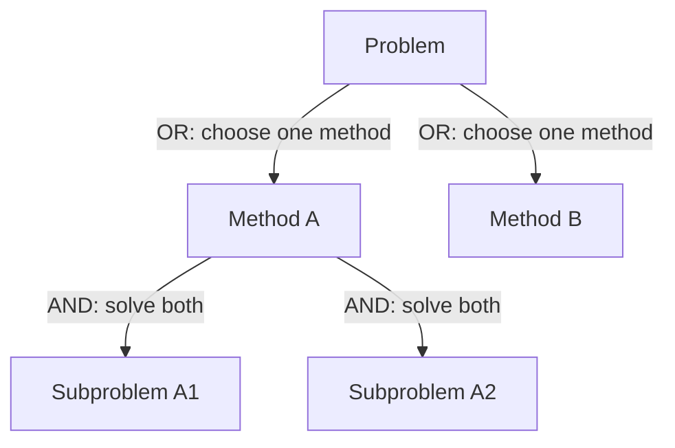

Exam writing points:

- Use AO* when the solution is a subgraph, not only a single path.
- OR nodes select the best alternative.
- AND nodes require all listed subgoals.
- Heuristic estimates guide which part of the graph to expand.

## Means-Ends Analysis

**Means-Ends Analysis** reduces the difference between the current state and the goal state. It identifies a difference, selects an operator that can reduce that difference, and then creates subgoals to satisfy the operator’s preconditions.

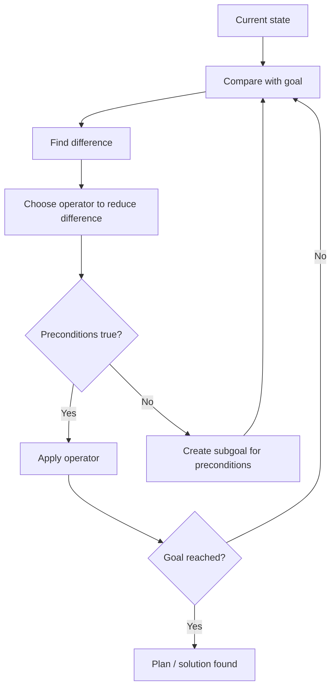

Exam example: to travel from one place to another, compare current location with destination. If far away, choose operators such as walk, drive, bus, cab, or fly. If the selected operator has preconditions such as having money or being at an airport, those become subgoals.

## Waiting for Quiescence

**Waiting for quiescence** belongs to game playing. If a game position is unstable, a shallow evaluation may be misleading. The idea is to continue search until a relatively stable or **quiescent** position is reached, then apply the evaluation function. In exam terms, write that it avoids evaluating positions during immediate tactical changes.

## PROLOG Representation and Structure

PROLOG represents knowledge using:

- **Facts**: unconditional truths, such as `student(raj).`
- **Rules**: conditional truths, such as `pass(X) :- study(X), clever(X).`
- **Queries**: questions to the system, such as `?- pass(raj).`

The structure of a PROLOG program is therefore a knowledge base of facts and rules plus user queries. PROLOG proves queries using unification, backward chaining, and backtracking.

## Conditional and Continuous Planning

**Conditional planning** is used when the agent must prepare for alternative outcomes. It is useful when action effects or observations can vary. The plan branches depending on conditions.

**Continuous planning** means planning continues during execution. If the environment changes or an action has an unexpected result, the agent updates the current state and revises the plan.

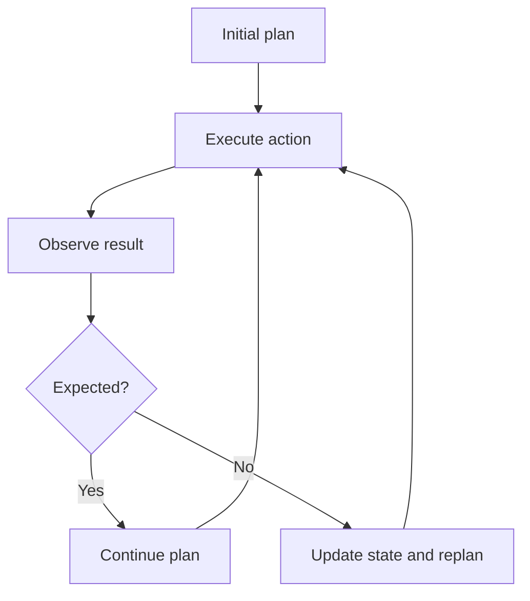

---

# 2. PYQ Frequency Analysis

The scanned PYQs repeatedly test the same structure: agents and PEAS early, search and A* in the middle, logic/resolution and expert systems later, and planning at the end.

| Topic | Frequency | Evidence from PYQs |
|---|---|---|
| A*, Best First, heuristic search, open/closed list | **High Frequency** | Route maps, graph search, Pacman/maze, A to K state graph, H to G graph |
| BFS/DFS/IDS/DLS properties | **High Frequency** | Direct comparison questions and expansion-order questions |
| Agent concepts, PEAS, environment types | **High Frequency** | Email spam agent, die-rolling robot, shelf-stocking robot, learning agent |
| CSP/backtracking/map coloring/seating | **High Frequency** | Map-coloring PYQ, dinner seating CSP, CSP heuristics |
| Minimax and alpha-beta pruning | **High Frequency** | Game trees in multiple papers; multi-player tuple game |
| Propositional/FOL translation and resolution | **High Frequency** | Baker puzzle, Raj passes AI, Scrooge/Rudolph, Jack/Curiosity, truth-table proofs |
| Expert systems and PROLOG | **High Frequency** | Medical/network/admission expert systems, PROLOG backtracking |
| Planning, STRIPS, goal stack, POP | **High Frequency** | Blocks World, robot painting, fried-eggs POP, STRIPS paint action |
| Hill climbing | Medium-High | Numeric function \(f(x)=-(x-3)^2\), Mario/Peach maze, tree heuristic |
| Wumpus World | Medium | Strong in slides, less visible in PYQ pages |

## PYQ Heat Map

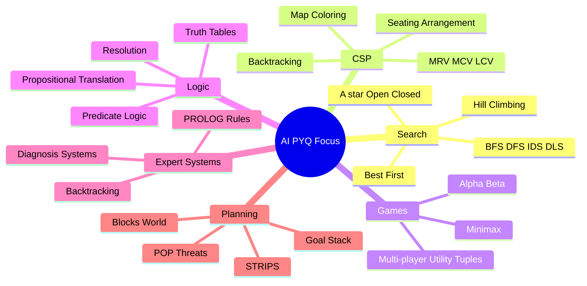

### What to Prioritize

| Priority | Topics | Why |
|---|---|---|
| First | A*, BFS/DFS, CSP, minimax, resolution, planning | These appear as numerical/procedural questions with direct marks. |
| Second | PEAS, environment types, expert-system components | These are repeat theory questions and easy scoring if structured well. |
| Third | Wumpus, GraphPlan, HTN, IDA* | Important from slides, but less frequent in visible PYQ pages. |

---

# 3. Exam Pattern by Syllabus Heading

## Unit 1 Pattern: Agents and Environments

Common PYQ styles:

- Define sensor, percept, effector/actuator, action for a given agent.
- Give PEAS for a new agent such as a grocery shelf-stocking robot.
- Classify an environment as accessible/observable, deterministic, episodic, static, discrete.
- Explain learning agent with example.

## Unit 2 Pattern: Uninformed Search

Common PYQ styles:

- Compare BFS, DFS, IDS, and DLS using completeness and optimality.
- Given a tree, list next nodes expanded by BFS, DFS, and hill climbing.
- Explain why BFS/DFS are weak methods.

## Unit 3 Pattern: Informed Search, CSP, Games

Common PYQ styles:

- Apply A* on a weighted graph with a heuristic table.
- Show open and closed lists.
- Find a route using \(g(n)\), \(h(n)\), and \(f(n)\).
- Solve a maze using Best First Search or A*.
- Apply hill climbing to a numeric or grid problem.
- Solve CSP using backtracking, MRV/LRV, MCV, and LCV.
- Compute minimax values and alpha-beta pruning cuts.

## Unit 4 Pattern: Logic

Common PYQ styles:

- Translate English into propositional logic.
- Translate English into predicate logic.
- Prove entailment using resolution.
- Prove equivalence using truth table.
- Convert rules/facts into clauses and derive contradiction.

## Unit 5 Pattern: PROLOG and Expert Systems

Common PYQ styles:

- Explain PROLOG backtracking with example.
- Design an expert system in PROLOG with at least four rules.
- Explain priority/conflict resolution when multiple expert-system rules apply.
- Discuss ethical considerations in medical expert systems.

## Unit 6 Pattern: Planning

Common PYQ styles:

- Solve Blocks World using goal stack planning.
- Generate a plan using a suitable planning technique.
- Design STRIPS operators for an action such as `paint`.
- Identify POP threats and resolve them using promotion/demotion.
- Explain limitations of goal stack planning.

---

# 4. Puzzle and Logic Deep-Dive

## Algorithm Selection Map

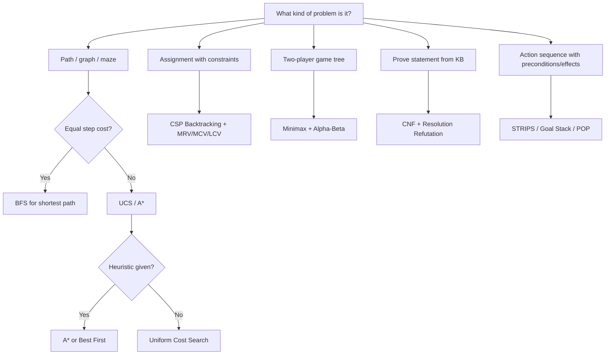

> [!TIP]
> In the exam, first identify the problem family. Half the solution becomes obvious once you know whether the question is search, CSP, game playing, logic, or planning.

## Puzzle Type 1: Graph Search and A*

### Strategy for Solving

1. Write start, goal, edge costs, and heuristic values.
2. Maintain **OPEN** sorted by the algorithm priority:
   - BFS: queue by depth.
   - UCS: lowest \(g(n)\).
   - Greedy Best First: lowest \(h(n)\).
   - A*: lowest \(f(n)=g(n)+h(n)\).
3. Move expanded nodes to **CLOSED**.
4. When a better path to an already seen node is found, update its \(g\), parent, and \(f\).
5. Stop when the goal is popped/expanded, not merely when first seen, unless the question explicitly says otherwise.
6. Reconstruct the path using parent pointers.

### Solved Example 1: BFS on A-to-K PYQ-Style State Graph

Transitions:

```text
A -> B, C
B -> E
C -> D, G
D -> F
E -> I, J
F -> none
G -> H, K
H -> L
I -> none
J -> K
K -> none
L -> none
```

Start \(A\), goal \(K\), unit cost.

BFS levels:

- Level 0: \(A\)
- Level 1: \(B, C\)
- Level 2: \(E, D, G\)
- Level 3: \(I, J, F, H, K\)

Shortest BFS path:

$$
A \to C \to G \to K
$$

Cost \(=3\).

### Solved Example 2: A* on Same Graph with PYQ Heuristics

Heuristics:

```text
A:9, B:4, C:5, D:7, E:3, F:10,
G:3, H:5, I:8, J:2, K:0, L:7
```

Trace:

| Step | Expanded | New OPEN values |
|---|---|---|
| 1 | A | B: \(g=1,h=4,f=5\); C: \(g=1,h=5,f=6\) |
| 2 | B | E: \(g=2,h=3,f=5\); C: \(f=6\) |
| 3 | E | J: \(g=3,h=2,f=5\); I: \(g=3,h=8,f=11\); C: \(f=6\) |
| 4 | J | K: \(g=4,h=0,f=4\); C: \(f=6\); I: \(f=11\) |
| 5 | K | Goal found |

Path returned:

$$
A \to B \to E \to J \to K
$$

Cost \(=4\). Note: the heuristic overestimates for some nodes, so this path need not be the shortest. In an exam, follow the stated heuristic table and show OPEN/CLOSED clearly.

### Solved Example 3: A* on PYQ-Style Directed Graph

Edges:

```text
S->A:2, S->B:3
A->C:3
B->C:1, B->D:3
C->D:1, C->E:3
D->F:2
E->G:2
F->G:1
```

Heuristics:

```text
S:6, A:4, B:4, C:4, D:3.5, E:1, F:1, G:0
```

A* trace summary:

- From \(S\): \(A(f=6)\), \(B(f=7)\). Expand \(A\).
- From \(A\): \(C(g=5,f=9)\). Expand \(B\).
- From \(B\): update \(C(g=4,f=8)\), add \(D(g=6,f=9.5)\). Expand \(C\).
- From \(C\): update \(D(g=5,f=8.5)\), add \(E(g=7,f=8)\).
- Expand \(E\), add \(G(g=9,f=9)\).
- Expand \(D\), add \(F(g=7,f=8)\).
- Expand \(F\), update \(G(g=8,f=8)\).
- Expand \(G\).

Final path:

$$
S \to B \to C \to D \to F \to G
$$

Cost \(=8\).

---

## Puzzle Type 2: Hill Climbing

### Strategy for Solving

1. Identify whether the problem maximizes or minimizes the heuristic.
2. Compare only neighbors of the current state.
3. Move to the best improving neighbor.
4. Stop if no neighbor improves the value.
5. Mention local optimum if the search stops before the goal.

### Solved Example 1: Numeric Hill Climbing

PYQ-style function:

$$
f(x)=-(x-3)^2
$$

Start \(x=0\), and each neighbor is generated by adding 1.

Values:

$$
f(0)=-9,\quad f(1)=-4,\quad f(2)=-1,\quad f(3)=0
$$

Since the goal is to maximize \(f(x)\), the next state from \(0\) is \(1\), because \(-4 > -9\).

### Solved Example 2: Hill Climbing Failure Pattern

Let:

```text
S(h=6) -> P(h=4), Q(h=2)
Q(h=2) -> R(h=5)
R(h=5) -> G(h=0)
```

Plain hill climbing from \(S\) chooses \(Q\), because \(h=2\) is best. From \(Q\), \(R\) is worse because \(h=5\), so the algorithm stops at \(Q\). This is a local minimum/false stopping point in a minimization heuristic.

---

## Puzzle Type 3: CSP Backtracking

### Strategy for Solving

1. Define variables, domains, and constraints.
2. Fix any given assignments first.
3. Use the specified order if the question gives one.
4. Check constraints immediately after each assignment.
5. If a later variable has no legal value, backtrack.
6. State final assignment and why it satisfies all constraints.

### Solved Example 1: Circular Seating CSP

Guests: \(A,B,C,D,E,F\). A sits in chair 1. Constraints:

- A not next to B.
- B not next to C.
- C not next to D or E.
- F not next to A or B.

Try alphabetical order with lower-numbered seats preferred.

1. \(A=1\).
2. \(B\) cannot be 2 or 6, so choose \(B=3\).
3. \(C\) cannot be next to \(B\), so avoid 2 and 4. Try \(C=5\), but later E has no legal place. Backtrack.
4. Choose \(C=6\).
5. \(D\) cannot sit next to \(C\), so choose \(D=2\).
6. \(E\) cannot sit next to \(C\), so choose \(E=4\).
7. \(F=5\). It is not next to A or B.

Valid seating:

$$
A1,\ D2,\ B3,\ E4,\ F5,\ C6
$$

### Solved Example 2: Map Coloring CSP

Variables: Borogrove, Rath, Brillig, Tove. Colors: red, blue, green. Constraint: adjacent regions must have different colors.

Exam method:

1. Draw region adjacency graph.
2. Choose most constrained region first, often Brillig because it touches several others.
3. Assign a color.
4. Remove that color from adjacent domains.
5. Continue with the region having fewest legal colors.

If Borogrove is already red, then any adjacent region cannot be red. Use **LCV** to choose the color that leaves the most options for neighbors.

---

## Puzzle Type 4: Minimax and Alpha-Beta

### Strategy for Solving Minimax

1. Identify MAX and MIN levels.
2. Back up terminal values upward.
3. At MAX nodes, take maximum.
4. At MIN nodes, take minimum.
5. The root value is the game value.

### Strategy for Alpha-Beta

1. Maintain \(\alpha\): best value MAX can guarantee so far.
2. Maintain \(\beta\): best value MIN can guarantee so far.
3. At MAX, update \(\alpha\).
4. At MIN, update \(\beta\).
5. Prune when \(\alpha \ge \beta\).

### Solved Example: Four-Branch Game Tree

Root is MAX. Four MIN children have leaf values:

```text
M1: 3, 10, 5, 4
M2: 15, 6, 2, 1
M3: 6, 2, 8, 5
M4: 11, 5, 7, 6
```

MIN values:

$$
M1=3,\quad M2=1,\quad M3=2,\quad M4=5
$$

MAX root value:

$$
\max(3,1,2,5)=5
$$

Optimal move: \(M4\).

If alpha-beta evaluates left to right:

- After \(M1\), \(\alpha=3\).
- In \(M2\), once value \(2\) is seen, \(\beta=2 \le \alpha=3\), so remaining children can be pruned.
- In \(M3\), once value \(2\) is seen, prune remaining children.
- \(M4\) must still be examined enough to show it can beat \(\alpha\).

---

## Puzzle Type 5: Logic and Resolution

### Strategy for Propositional Resolution

1. Assign symbols to statements.
2. Convert implications using \(P \to Q \equiv \neg P \lor Q\).
3. Write all clauses in CNF.
4. Add the negation of the conclusion.
5. Resolve complementary literals.
6. If the empty clause is derived, the conclusion is proved.

### Solved Example: Baker Youngest Child Puzzle

Let:

- \(A\): Alice is youngest.
- \(B\): Bill is youngest.
- \(C\): Carl is youngest.

Given:

$$
\neg B \to A
$$

$$
\neg C \to \neg A
$$

Only one child is youngest.

Clauses:

$$
B \lor A
$$

$$
C \lor \neg A
$$

Exactly-one constraints include:

$$
\neg A \lor \neg B,\quad \neg A \lor \neg C,\quad \neg B \lor \neg C
$$

To prove \(B\), add \(\neg B\).

Resolution:

1. \(\neg B\) and \(B \lor A\) give \(A\).
2. \(A\) and \(\neg A \lor \neg C\) give \(\neg C\).
3. \(\neg C\) and \(C \lor \neg A\) give \(\neg A\).
4. \(A\) and \(\neg A\) give empty clause.

Therefore, \(B\) is proved: Bill is the youngest child.

### Solved Example: English to Propositional Logic

Sentence: "It rains if and only if Liron is sick."

Let:

- \(R\): It is raining.
- \(S\): Liron is sick.

Translation:

$$
R \leftrightarrow S
$$

Sentence: "If it rains, then I will stay at home."

Let \(H\): I will stay at home.

Translation:

$$
R \to H
$$

---

## Puzzle Type 6: Planning and STRIPS

### Strategy for Goal Stack Planning

1. Write initial state and goal state.
2. Push the full goal onto the stack.
3. Pick an unsatisfied goal literal.
4. Choose an action whose effect achieves it.
5. Push that action’s preconditions.
6. When preconditions are satisfied, execute the action and update the state.
7. Continue until all goals are true.

### Solved Example: Blocks World Goal Stack

Start:

```text
On(B,A), OnTable(A), OnTable(C), OnTable(D), Clear(B), Clear(C), Clear(D)
```

Goal:

```text
On(C,A), On(B,D)
```

Plan:

1. `Unstack(B,A)` to clear A.
2. `Putdown(B)` so B is available later.
3. `Pickup(C)`.
4. `Stack(C,A)` to achieve `On(C,A)`.
5. `Pickup(B)`.
6. `Stack(B,D)` to achieve `On(B,D)`.

### Solved Example: STRIPS Operator for Paint

Action:

```text
Paint(object, color)
```

Preconditions:

```text
At(robot, object)
Holding(robot, brush(color))
Unpainted(object)
```

Effects:

```text
Painted(object, color)
not Unpainted(object)
```

In exam answers, always separate precondition, add effect, and delete effect.

---

# 5. Quick Answer Templates

## 5-Mark Template: A* Search

**A\*** is an informed search algorithm that combines the actual path cost \(g(n)\) and heuristic estimate \(h(n)\). It evaluates nodes using:

$$
f(n)=g(n)+h(n)
$$

The algorithm keeps an OPEN list ordered by the lowest \(f(n)\) and a CLOSED list of expanded nodes. If the heuristic is admissible, A* is optimal; if the heuristic is consistent, repeated-state handling becomes safer because \(f(n)\) values do not decrease along a path. In route and graph problems, A* is applied by calculating \(g,h,f\) for each generated node and expanding the smallest \(f\) node until the goal is selected.

## 5-Mark Template: PEAS

**PEAS** specifies an agent task using Performance measure, Environment, Actuators, and Sensors. The performance measure defines success, the environment defines where the agent operates, actuators define how it acts, and sensors define how it perceives. PEAS is important because the correct agent design depends on the task environment.

## 5-Mark Template: Resolution

Resolution proves entailment by contradiction. To prove \(KB \models \alpha\), add \(\neg \alpha\) to the KB, convert all sentences into CNF clauses, and repeatedly resolve clauses containing complementary literals. If the empty clause is produced, \(KB \land \neg \alpha\) is unsatisfiable, so \(\alpha\) follows from the KB.

## 5-Mark Template: Expert System

An expert system is an AI program that imitates a human expert in a specialized domain. It consists of a knowledge base, inference engine, working memory, explanation facility, user interface, and sometimes a knowledge acquisition module. The knowledge base stores rules and facts; the inference engine applies reasoning such as forward or backward chaining to draw conclusions.

## 5-Mark Template: POP Threats

In Partial Order Planning, a causal link \(A \xrightarrow{p} B\) means action A establishes condition \(p\) for action B. A threat occurs when another action can delete \(p\) between A and B. The planner resolves threats using promotion, placing the threatening action after B, or demotion, placing it before A. This preserves correctness while maintaining least commitment.

---

# 6. Practice Drill

## 10 Mirror Questions

1. Define an intelligent agent. For an online exam proctoring system, identify one sensor, one actuator, one percept, and one action.
2. Give a PEAS description for a hospital medicine-delivery robot.
3. Compare BFS, DFS, DLS, and IDS with respect to completeness and optimality.
4. A graph has start \(S\), goal \(G\), and heuristic values on nodes. Explain how OPEN and CLOSED lists are maintained in A*.
5. For a hill-climbing problem with \(f(x)=-(x-4)^2\), starting from \(x=1\), state the next state if the neighbor is generated by adding 1.
6. Convert the sentence "You will pass AI only if you study" into propositional logic.
7. Explain how forward chaining differs from backward chaining for Horn clauses.
8. Design four PROLOG-style rules for an expert system that diagnoses laptop battery issues.
9. Explain minimax and alpha-beta pruning using a small game tree.
10. Write STRIPS preconditions and effects for `Move(robot, from, to)` in a two-location object-transfer problem.

## 5 Mixed Unsolved Puzzles

### Puzzle 1: A* Graph

Use A* from \(S\) to \(G\).

```text
Edges:
S->A:2, S->B:4
A->C:2, A->D:5
B->D:1
C->G:6
D->G:2

Heuristics:
S:6, A:4, B:3, C:5, D:1, G:0
```

Show OPEN and CLOSED lists.

### Puzzle 2: BFS vs DFS

Given:

```text
A -> B, C
B -> D, E
C -> F
D -> none
E -> G
F -> G
```

Start \(A\), goal \(G\). List expansion order and path for BFS and DFS, assuming left-to-right expansion.

### Puzzle 3: CSP Seating

Five students \(A,B,C,D,E\) sit in a row of five seats. Constraints:

- A cannot sit next to B.
- C must sit left of D.
- E cannot sit in seat 1 or 5.
- B must be in an even-numbered seat.

Find one valid assignment using backtracking.

### Puzzle 4: Minimax

Root is MAX. Its three MIN children have terminal values:

```text
M1: 4, 8, 2
M2: 7, 1, 6
M3: 3, 5, 9
```

Find all MIN values and the root value. Then mark alpha-beta pruning if evaluated left to right.

### Puzzle 5: Resolution

Let:

- \(P\): student studies.
- \(Q\): student passes.
- \(R\): student is happy.

KB:

$$
P \to Q
$$

$$
Q \to R
$$

$$
P
$$

Prove \(R\) using resolution.

---

# 7. Model Question Papers

These papers stay inside the supplied syllabus. Paper 1 follows the visible PYQ style closely. Paper 2 uses a different but still exam-valid format. Paper 3 is a mixed rapid-revision paper.

## Model Paper 1: PYQ-Style ESE Pattern

**Subject:** Artificial Intelligence  
**Max Marks:** 60  
**Time:** 2 Hours  
**Instructions:** All questions are compulsory. Figures to the right indicate marks. Draw neat diagrams wherever necessary.

### Q1. Agents and Environments

**A.** Consider a smart email filtering agent that checks unread messages and classifies each as spam or non-spam. Identify one sensor, one percept, one actuator, and one action. Also write two mappings of percepts to actions using the idea of an agent function. **[4]**

**B.** Write a PEAS description for an autonomous grocery shelf-stocking robot. Also classify its environment as fully/partially observable, deterministic/stochastic, episodic/sequential, static/dynamic, discrete/continuous, and single-agent/multi-agent. **[6]**

### Q2. Uninformed Search

**A.** Compare BFS, DFS, DLS, and IDS with respect to completeness, optimality, time complexity, and space complexity. **[6]**

**B.** Given the tree below, start at \(A\) and goal is \(G\). List expansion order and path using BFS and DFS. Assume left-to-right expansion. **[4]**

```text
A -> B, C
B -> D, E
C -> F
D -> none
E -> G
F -> G
```

### Q3. Informed Search and CSP

**A.** Apply A* from \(S\) to \(G\). Show OPEN and CLOSED lists. **[6]**

```text
Edges:
S->A:2, S->B:3
A->C:3
B->C:1, B->D:3
C->D:1, C->E:3
D->F:2
E->G:2
F->G:1

Heuristics:
S:6, A:4, B:4, C:4, D:3.5, E:1, F:1, G:0
```

**B.** Five guests \(A,B,C,D,E\) must sit in a row. \(A\) cannot sit next to \(B\), \(C\) must sit left of \(D\), \(E\) cannot sit at either end, and \(B\) must sit in an even-numbered seat. Solve using backtracking. **[4]**

### Q4. Logic

**A.** Translate the following into propositional logic. **[4]**

1. If it rains, I will stay at home.
2. You will qualify only if you work hard.
3. Birds fly if and only if the sky is clear.
4. Liron is hungry but happy.

**B.** Let \(P\): student studies, \(Q\): student passes, \(R\): student is happy. Given \(P \to Q\), \(Q \to R\), and \(P\), prove \(R\) using resolution. **[6]**

### Q5. Expert Systems and PROLOG

**A.** Define expert system and explain its major components. **[4]**

**B.** Design a PROLOG-style expert system with at least four rules to diagnose common network connectivity problems. Include one sample query and conclusion. **[6]**

### Q6. Planning and Games

**A.** Write STRIPS operators for `Paint(object, color)` where the robot must hold a brush of the correct color and the effect is to change the color of the object. **[4]**

**B.** Root is MAX. Its three MIN children have terminal values: \(M1: 4,8,2\), \(M2: 7,1,6\), \(M3: 3,5,9\). Compute minimax values and identify alpha-beta pruning opportunities with left-to-right evaluation. **[6]**

---

## Model Paper 2: Application-Oriented Pattern

**Max Marks:** 60  
**Format:** Answer all questions. Each question tests theory plus application.

### Q1. Agent Design Case Study **[10]**

A hospital medicine-delivery robot must carry medicines from a pharmacy to patient rooms. Write PEAS, classify the environment, and explain whether a simple reflex, model-based, goal-based, utility-based, or learning agent is most suitable.

### Q2. Search Strategy Selection **[10]**

For each problem, choose the most suitable search method from BFS, DFS, UCS, A*, Hill Climbing, or Bidirectional Search. Justify briefly.

1. Maze with equal movement cost.
2. Road map with different distances.
3. Route map with straight-line distance heuristic.
4. Very deep tree with unknown solution depth and unit step cost.
5. Local optimization where only neighboring states are compared.

### Q3. Heuristic Search Calculation **[10]**

Given:

```text
Edges:
A->B:1, A->C:4
B->D:3, B->E:2
C->F:2
D->G:5
E->G:4
F->G:3

Heuristics:
A:6, B:4, C:3, D:4, E:2, F:2, G:0
```

Apply A*. Show \(g,h,f\), OPEN, CLOSED, and final path.

### Q4. Logic and Chaining **[10]**

Consider rules:

```text
Clever(x) and Studies(x) -> PassAI(x)
Lucky(x) and Clever(x) -> PassAI(x)
VITStudent(x) -> Clever(x)
VITStudent(Raj)
Studies(Raj)
```

Translate into predicate logic and prove `PassAI(Raj)` using forward chaining. Also explain how backward chaining would start from the goal.

### Q5. Expert System Design **[10]**

Design an expert system for laptop troubleshooting. Include components, working memory facts, at least four rules, and explain how rule priority can be handled when multiple rules match.

### Q6. Planning **[10]**

Initial state: `On(B,A)`, `OnTable(A)`, `OnTable(C)`, `Clear(B)`, `Clear(C)`. Goal: `On(C,A)` and `On(B,C)`. Use goal stack planning. State the actions, preconditions, and effects you use.

---

## Model Paper 3: Mixed Revision Pattern

**Max Marks:** 60  
**Format:** Short answers, procedures, and one design question.

### Section A: Short Answers **[20]**

Answer any ten. Each carries 2 marks.

1. Define rational agent.
2. What is autonomy in an agent?
3. State the four components of a well-defined problem.
4. Why is DFS not complete in infinite-depth spaces?
5. What is an admissible heuristic?
6. Define consistent heuristic.
7. What is a Horn clause?
8. What is the empty clause in resolution?
9. Define causal link in POP.
10. What is a threat in POP?
11. What is unification in PROLOG?
12. What is a planning graph?

### Section B: Procedures **[30]**

**B1.** Apply BFS and UCS on the graph below and explain why results differ when edge costs are unequal. Start \(S\), goal \(G\). **[6]**

```text
S->A:1, S->B:5
A->G:10
B->G:1
```

**B2.** Convert \((P \to Q) \leftrightarrow (\neg P \lor Q)\) using truth-table reasoning or logical equivalence. **[6]**

**B3.** Solve a three-variable CSP: \(X,Y,Z \in \{1,2,3\}\), \(X \ne Y\), \(Y \ne Z\), \(X < Z\). Show backtracking steps. **[6]**

**B4.** Explain minimax and alpha-beta pruning with a two-level game tree. **[6]**

**B5.** Explain GraphPlan using proposition levels, action levels, and mutex relations. **[6]**

### Section C: Design Question **[10]**

Design an AI system for medical diagnosis. Include agent view, PEAS, expert-system components, rule examples, and one limitation or ethical concern.

---

## Answerability Audit

I checked the generated papers against this guide. The table below shows where each question is answerable from the notes and whether any extra content was added.

| Paper | Topic checked | Answerable from guide? | Where covered |
|---|---|---:|---|
| Paper 1 Q1 | Agent function, PEAS, environment classification | Yes | Unit 1, Unit 1 Glossary, PEAS table |
| Paper 1 Q2 | BFS/DFS/DLS/IDS and expansion order | Yes | Unit 2, search comparison tables, Puzzle Type 1 |
| Paper 1 Q3 | A* and CSP backtracking | Yes | Unit 3, A* flow, CSP flow, solved examples |
| Paper 1 Q4 | Propositional translation and resolution | Yes | Unit 4, logic conversion table, Puzzle Type 5 |
| Paper 1 Q5 | Expert system and PROLOG design | Yes | Unit 5, expert-system architecture, design frame |
| Paper 1 Q6 | STRIPS and minimax | Yes | Unit 6, STRIPS schema, Puzzle Type 4 |
| Paper 2 Q1 | Choosing agent type | Yes | Unit 1 and glossary |
| Paper 2 Q2 | Algorithm selection | Yes | Algorithm Selection Map and Unit 2/3 |
| Paper 2 Q3 | A* calculation | Yes | A* sections and solved examples |
| Paper 2 Q4 | Predicate logic and chaining | Yes | Unit 4, chaining notes, syllabus add-on |
| Paper 2 Q5 | Rule priority | Yes | Unit 5 rule-priority table |
| Paper 2 Q6 | Goal stack planning | Yes | Unit 6 and Puzzle Type 6 |
| Paper 3 Section A | Definitions | Yes | Must-Know Terms Explained |
| Paper 3 Section B | Mixed procedures | Yes | Puzzle Deep-Dive, logic, CSP, planning |
| Paper 3 Section C | Integrated design | Yes | Units 1 and 5 |

### Content Added After Audit

- Added one-line explanations for all must-know terms.
- Added AO* notes because the syllabus lists AO* but the original guide was thin on it.
- Added Means-Ends Analysis because it appears in the syllabus and PYQ-style planning/search questions.
- Added Waiting for Quiescence because the syllabus lists it under game playing.
- Added PROLOG representation and structure notes for Unit 5.
- Added conditional and continuous planning notes for Unit 6.
- Added model question papers that stay within AI3001 syllabus boundaries.

---

# 8. Last-Day Revision Checklist

- Memorize \(f(n)=g(n)+h(n)\), admissibility, and consistency.
- Practice OPEN/CLOSED list tables for A*.
- Revise BFS/DFS/IDS/DLS completeness and optimality.
- Write PEAS quickly for any new agent domain.
- Practice converting English into propositional and predicate logic.
- Practice resolution by adding negated conclusion and deriving empty clause.
- Learn expert system components and one PROLOG mini-example.
- Practice STRIPS: action, preconditions, add effects, delete effects.
- Practice POP: causal link, threat, promotion, demotion.
- For game trees, compute minimax bottom-up before marking alpha-beta cuts.
