# Deep Learning ESE Study Material - Enhanced Revision Edition

**Prepared from your supplied material only**

Sources used:
- `Syllabus.pdf`
- `Unit 01.pptx` to `Unit 06.pptx`
- `Deep Learning_ESE Question paper format  AY 23-24.pdf`
- `Deep Learning_ESE Question paperAY 24-25 (2).pdf`

---

## 0. Exam Map

### Paper Pattern Snapshot

| Area | 2023-24 Paper | 2024-25 Paper | Priority |
|---|---|---|---|
| Logistic regression / ANN basics | Activation functions, GridSearchCV, ANN forward-backward pass | Logistic regression as simplified NN, sigmoid numerical, learning-rate numerical | Very high |
| Optimization | Gradient descent, SGD comparison | SGD vs Adam convergence, GD vs SGD vs mini-batch | Very high |
| Overfitting control | Batch norm, L2, data augmentation, transfer learning | Dropout numerical, hyperparameter tuning, L1/L2/dropout comparison | Very high |
| CNN | 28x28 grayscale CNN calculation | 32x32 color CNN calculation, FC parameters | Very high |
| Sequence models | LSTM, RNN vanishing/exploding gradient | Encoder-decoder, RNN types, exploding gradient symptoms | Very high |
| Transformers | Attention models | Attention long-range dependency | High |
| Object detection | Bounding boxes, anchor boxes | Classification vs detection, sliding window | High |
| Advanced CNN | ResNet, Inception | ResNet identity shortcut and element-wise addition | Medium-high |
| GAN | Generator/discriminator working | Training difference of generator and discriminator | Medium-high |
| NLP | Text analysis in syllabus | Text classification and DL models | Medium |

### 10-Day Smart Revision Order

| Day | Main Target | Numericals |
|---|---|---|
| 1 | Logistic regression, neuron, activation, loss | Sigmoid output, one-step weight update |
| 2 | Gradient descent, SGD, mini-batch, momentum, RMSProp, Adam | Learning-rate update |
| 3 | Overfitting, L1/L2, dropout, batch normalization | Dropout active-neuron count |
| 4 | CNN basics: convolution, padding, stride, pooling | 28x28 and 32x32 CNN dimensions |
| 5 | CNN architectures: VGG, ResNet, Inception, MobileNet, transfer learning | 1x1 convolution parameters |
| 6 | RNN, sequence data, vanishing/exploding gradient | Basic RNN forward calculation |
| 7 | LSTM, GRU, encoder-decoder | LSTM gate calculation |
| 8 | Embeddings, self-attention, transformer, BERT | Attention score/output |
| 9 | Object detection: sliding window, IoU, NMS, anchors, R-CNN, YOLO | IoU and anchor-output vector |
| 10 | Full paper practice | Mixed numericals |

---

# 1. Foundations of Neural Networks

## 1.1 Why Deep Learning?

Deep learning is useful for complex problems with large unstructured data such as images, text, audio, speech, and time-series data. The main advantage is that deep networks learn features automatically through layers, instead of depending only on manually designed features.

### Machine Learning vs Deep Learning

| Point | Machine Learning | Deep Learning |
|---|---|---|
| Feature extraction | Often manual | Automatic through layers |
| Data type | Works well with structured data | Strong for image, text, audio |
| Model depth | Usually shallow | Multiple hidden layers |
| Data need | Can work with smaller data | Usually needs larger data |
| Computation | Comparatively lower | Higher |

In machine learning, the user usually decides which features are important. For example, in image classification we may manually extract edges, corners, or texture features before giving them to a classifier.

In deep learning, the network learns features automatically. In a CNN, early layers may learn edges, middle layers may learn shapes, and deeper layers may learn object parts such as eyes, wheels, or faces.

**Exam line:** Deep learning is preferred when data is large, complex, and unstructured because it can learn hierarchical features automatically.

## 1.2 Biological Neuron to Artificial Neuron

| Biological term | Artificial NN equivalent |
|---|---|
| Dendrites | Inputs |
| Synapse | Connection |
| Synaptic weight | Weight |
| Cell body | Processing unit |
| Axon | Output |

The dendrites of a biological neuron receive signals, just like input features enter an artificial neuron. The synapse decides the strength of communication; in ANN this role is played by weights.

The cell body combines incoming signals, similar to calculating `z = wTx + b`. The axon sends the final signal forward, similar to the output activation of an artificial neuron.

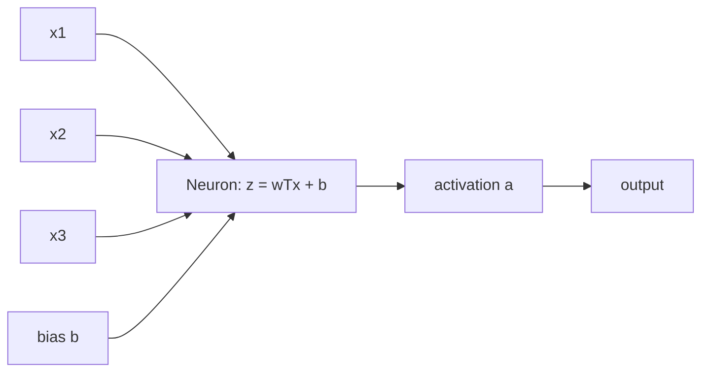

For an artificial neuron:

```text
z = w1x1 + w2x2 + ... + wnxn + b
a = activation(z)
```

Weights decide the strength of each input. Bias shifts the activation threshold. The activation function decides whether and how much the neuron fires.

## 1.3 Logistic Regression as a Simplified Neural Network

Logistic regression is a shallow neural network because it has:
- input features;
- weights and bias;
- weighted sum calculation;
- sigmoid activation;
- output probability.

Input features are the values used for prediction, such as pixel intensity, age, or marks. Weights decide how strongly each feature affects the output, and bias shifts the decision boundary.

The weighted sum is passed through sigmoid, so the output becomes a probability. For example, if output is `0.82`, the model is saying there is an 82% chance that the input belongs to class 1.

It does not have multiple hidden layers, so it is a simplified neural network.

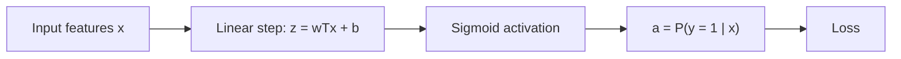

### Important Formula Set

```text
z = wTx + b
a = sigmoid(z) = 1 / (1 + e^-z)
L(a,y) = -[y log(a) + (1-y) log(1-a)]
J = average of all losses
```

### How to Write in Exam

Logistic regression is used for binary classification. It accepts input vector `x`, computes a weighted sum `z = wTx + b`, applies sigmoid activation to produce probability `a`, and compares this with actual class `y` using binary cross-entropy loss. Since it has the same basic components as a neural network, it is considered a simplified/shallow neural network.

## 1.4 Activation Functions

Activation functions introduce non-linearity. Without activation functions, even a deep network would behave like a linear model.

| Activation | Output range | Use |
|---|---:|---|
| Unipolar binary | 0 or 1 | Simple threshold output |
| Bipolar binary | -1 or 1 | Binary decision with bipolar output |
| Sigmoid | 0 to 1 | Binary classification probability |
| Non-linear activations | Depends on function | Hidden layers for complex patterns |

Unipolar binary activation gives either `0` or `1`, so it is useful when the neuron has to make a hard yes/no decision. For example, if the net input crosses a threshold, the neuron can output `1`; otherwise it outputs `0`.

Bipolar binary activation gives `-1` or `1`. It is useful when outputs must represent two opposite states, such as negative/positive response instead of absent/present response.

Sigmoid converts any real value into the range `0` to `1`. This makes it suitable for binary classification, such as predicting whether an image belongs to class 1 or not.

Non-linear activations in hidden layers allow the network to learn complex patterns. For example, in image recognition, non-linearity helps combine simple edges into curves, shapes, and eventually objects.

### Choosing Activation Functions

Choose based on:
- output range needed;
- task type;
- gradient behavior;
- training stability;
- whether the layer is hidden or output.

Output range means the type of value expected from the layer. If the output must be a probability, sigmoid is a good choice because its output lies between `0` and `1`.

Task type matters because binary classification, multi-class classification, and feature-learning hidden layers need different behavior. For example, logistic regression uses sigmoid at the output for class `0/1` prediction.

Gradient behavior is important because training depends on gradients during backpropagation. If gradients become too small, learning becomes slow, which is why activation choice affects convergence.

Training stability means the activation should help the model train smoothly without exploding or vanishing updates. A stable activation helps weights update in a controlled manner across epochs.

Layer position also matters. Hidden layers generally need non-linear activation for feature learning, while the output layer should match the target, such as sigmoid for binary output.

For binary classification output, sigmoid is suitable because it gives a probability between 0 and 1. Hidden layers need non-linear activation so the network can learn complex relations.

## 1.5 Forward and Backward Propagation

Forward propagation computes predictions. Backward propagation computes gradients and updates weights to reduce loss.

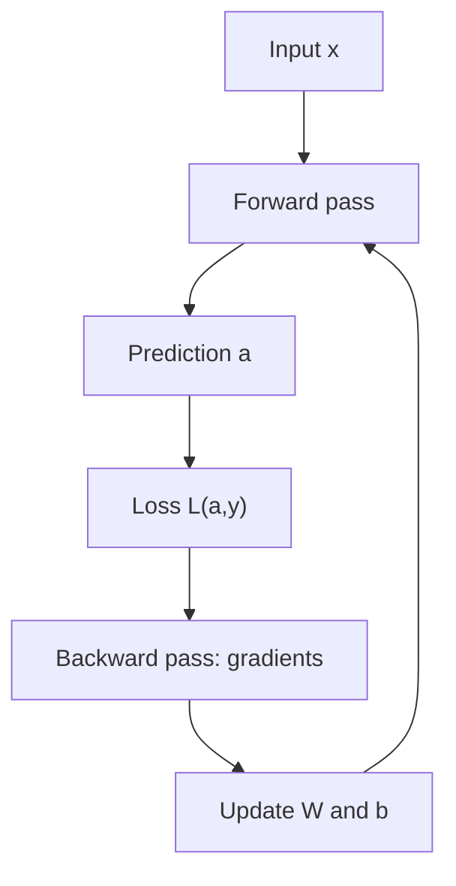

For sigmoid output with binary cross-entropy:

```text
dz = a - y
dW = dz * x
db = dz
W = W - alpha*dW
b = b - alpha*db
```

---

# 2. Training Challenges and Improvements

## 2.1 Overfitting

Overfitting means the model performs very well on training data but poorly on unseen/test data.

Example from 2024-25 paper:

```text
Training accuracy = 99%
Testing accuracy = 75%
```

This indicates overfitting because the model has memorized training patterns but has not generalized well.

### Remedies

| Method | How it helps |
|---|---|
| Data augmentation | Increases training variety |
| Early stopping | Stops training before validation performance worsens |
| L1/L2 regularization | Penalizes large/complex weights |
| Dropout | Randomly disables neurons during training |
| Batch normalization | Stabilizes layer activations |
| Hyperparameter tuning | Finds better model settings |

Data augmentation is useful when the model has limited training examples. For image tasks, rotating, flipping, shifting, or scaling an image creates new variations so the model does not memorize only the original images.

Early stopping watches validation performance while training. If validation loss starts increasing, training is stopped because the model has begun learning training-specific patterns instead of general rules.

L1/L2 regularization discourages overly large weights. A network with smaller controlled weights is usually simpler and less likely to memorize noise in the training data.

Dropout randomly switches off some neurons during training. For example, with dropout rate `0.3`, only 70 out of 100 neurons remain active in a forward pass, forcing the model to avoid dependence on one fixed path.

Batch normalization keeps activations on a stable scale. This helps deeper networks train faster because each layer receives better-conditioned inputs.

Hyperparameter tuning improves generalization by choosing better values for settings like learning rate, dropout rate, batch size, optimizer, and regularization strength.

## 2.2 Hyperparameter Tuning

Hyperparameters are selected before training. Examples:
- learning rate;
- number of layers;
- number of neurons;
- dropout rate;
- batch size;
- epochs;
- optimizer;
- regularization parameter.

Learning rate controls step size during weight updates. A very small learning rate can make training slow, while a very large one may overshoot the minimum.

Number of layers and neurons controls model capacity. Too few may underfit; too many may overfit, especially when the dataset is small.

Dropout rate decides how many neurons are randomly disabled during training. For example, dropout `0.3` drops 30% neurons and keeps 70% active.

Batch size decides how many examples are used before one update. Small batches update frequently but noisily, while large batches are more stable but computationally heavier.

Epochs decide how many times the model sees the full training data. Too few epochs may underfit; too many may overfit unless early stopping is used.

Optimizer decides the update rule. SGD is simple but may be slow; Adam can converge faster because it uses adaptive update behavior.

Regularization parameter controls how strongly large weights are penalized. A higher value reduces overfitting but may also make the model too simple.

For poor generalization, tune:
- dropout rate;
- L1/L2 regularization strength;
- learning rate;
- number of layers/neurons;
- batch size;
- early stopping patience;
- optimizer.

### GridSearchCV Style Explanation

Grid search tries all combinations from a predefined set. Each combination is trained/evaluated, and the best one is selected based on validation performance.

```text
learning_rate = [0.01, 0.001]
dropout = [0.2, 0.3, 0.5]
optimizer = [SGD, Adam]
```

The model tests combinations and chooses the one giving better generalization.

## 2.3 Regularization

Regularization adds a penalty term to reduce model complexity.

```text
Cost = Loss + Regularization term
```

### L1 vs L2 vs Dropout

| Technique | Main idea | Effect |
|---|---|---|
| L1 | Penalizes absolute weights | Can make weights exactly zero; useful for compression |
| L2 | Penalizes squared weights | Shrinks weights toward zero; common weight decay |
| Dropout | Randomly removes neurons during training | Prevents dependence on specific neurons |

L1 regularization is useful when we want some weights to become exactly zero. This can remove less useful features and make the model more compact.

L2 regularization is commonly used to reduce overfitting by shrinking weights smoothly. It is called weight decay because it pushes weights toward smaller values without usually making them exactly zero.

Dropout does not add a penalty to the cost function. Instead, it randomly removes neurons during training, so the network learns multiple robust paths instead of depending on a few neurons.

**Key difference:** L1/L2 modify the cost function using a penalty term. Dropout changes the network structure temporarily during each training iteration.

## 2.4 Dropout

Dropout randomly removes neurons and their incoming/outgoing connections during training. This forces the network to learn more robust features.

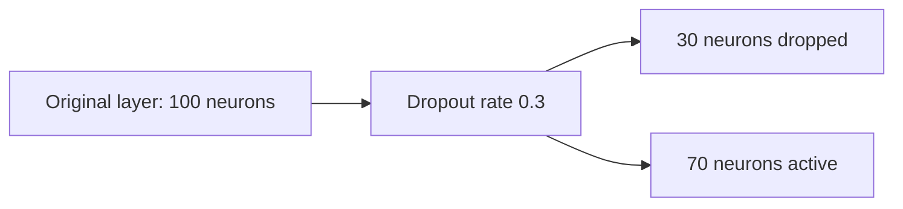

If dropout rate is `0.3`, active fraction is:

```text
1 - 0.3 = 0.7
```

For 100 neurons:

```text
Active neurons = 100 * 0.7 = 70
```

## 2.5 Batch Normalization

Batch normalization normalizes activations inside a mini-batch. It reduces internal covariate shift, stabilizes training, and speeds convergence.

### Internal Covariate Shift

As data moves through multiple layers, activation distributions keep changing because weights and biases are updated. This moving distribution makes learning difficult.

### Batch Norm Steps

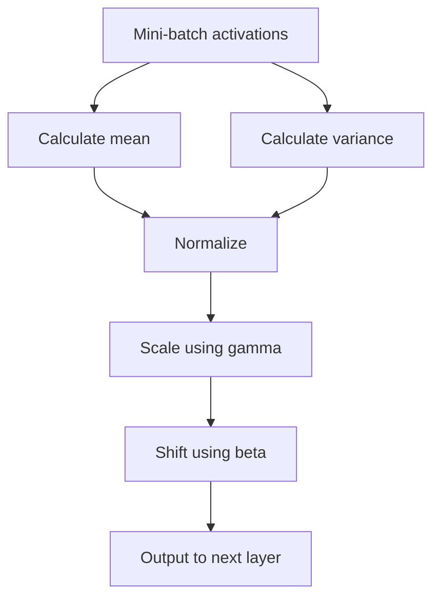

Important parameters:
- `gamma`: learnable scale;
- `beta`: learnable shift;
- moving mean and moving variance: saved state.

`gamma` allows the network to stretch or compress normalized activations. Without it, normalization may restrict the layer too much, so gamma gives flexibility back to the model.

`beta` shifts the normalized activation values. This is useful because sometimes the best activation distribution does not have to be centered exactly at zero.

Moving mean and moving variance are stored during training and used later during testing/inference. This is needed because at test time the model may receive one example instead of a full mini-batch.

Exam answer:
Batch normalization improves performance by keeping activations on a stable scale, reducing internal covariate shift, helping gradients flow better, allowing faster convergence, and reducing sensitivity to poor initialization.

## 2.6 Optimizers

Optimizers decide how weights and biases are updated to minimize loss.

### Gradient Descent Variants

| Method | Gradient computed using | Update frequency | Strength | Weakness |
|---|---|---|---|---|
| Batch GD | Entire dataset | Once per epoch | Stable | Slow for large data |
| SGD | One sample | Very frequent | Faster updates | Noisy path |
| Mini-batch GD | Small batch | Frequent | Balance of speed/stability | Batch size must be chosen |

Batch gradient descent calculates the gradient using all training examples before updating weights. It gives a stable direction, but for large datasets it is slow because one update needs the whole dataset.

Stochastic gradient descent updates weights after each training example. It can move faster initially, but because each update depends on only one sample, the training path can be noisy.

Mini-batch gradient descent uses a small group of examples for each update. It is widely used in deep learning because it balances the stability of batch GD and the speed of SGD.

### SGD vs Adam Convergence

From the 2024-25 paper:
- Model A uses SGD with learning rate `0.01`;
- Model B uses Adam with learning rate `0.001`;
- Model A converges slowly but Model B converges faster.

Reason:
SGD uses a more direct gradient update and can move slowly or noisily depending on learning rate and gradient direction. Adam combines momentum-like behavior with adaptive learning-rate ideas, so it can adjust updates more effectively for each parameter and often converges faster.

### Momentum

Momentum uses exponentially weighted averages of gradients:

```text
VdW = beta*VdW + (1-beta)*dW
Vdb = beta*Vdb + (1-beta)*db
W = W - alpha*VdW
b = b - alpha*Vdb
```

It smooths oscillations and helps faster movement in useful directions.

Example: if normal gradient descent keeps moving left-right while slowly going downward, momentum reduces the left-right oscillation and builds speed in the useful downward direction.

### RMSProp

RMSProp adapts learning rates using a moving average of squared gradients. It improves convergence stability.

RMSProp is helpful when some parameters receive large gradients and others receive small gradients. It adjusts the update size so training does not become unstable in directions with large gradients.

### Adam

Adam combines the benefit of momentum and adaptive learning-rate behavior. That is why it often trains faster than plain SGD.

In exam comparison, write that Adam uses past-gradient information and adaptive step sizes, so it can converge faster even with a smaller learning rate such as `0.001`.

---

# 3. CNN and Image Processing

## 3.1 Image Representation

Images are converted into numbers before being processed:

| Representation | Meaning |
|---|---|
| Grayscale | One intensity value per pixel |
| RGB | Red, green, blue values per pixel |
| Feature extraction | Edges, corners, textures, CNN features |
| Histogram | Frequency distribution of pixel intensities |

Grayscale representation stores one value per pixel, usually showing brightness. For example, a handwritten digit image can be represented as a `28 x 28 x 1` matrix.

RGB representation stores three values per pixel: red, green, and blue. For example, a color image of size `32 x 32` is represented as `32 x 32 x 3`.

Feature extraction means converting raw pixels into meaningful patterns like edges, corners, textures, or CNN-learned features. For example, detecting vertical edges can help recognize object boundaries.

Histogram representation counts how often each pixel intensity appears. It can describe image brightness, contrast, and intensity distribution.

## 3.2 Image Preprocessing

| Technique | Purpose |
|---|---|
| Resizing | Uniform input size |
| Grayscaling | Reduces computation |
| Binarization | Converts to black/white using threshold |
| Contrast enhancement | Improves visual distinction |
| Noise reduction | Removes unwanted noise |
| Normalization | Brings pixel values to useful range |

Resizing makes all images the same size so they can be processed by the same neural network. For example, every image may be resized to `32 x 32` before CNN training.

Grayscaling converts a color image into one intensity channel. This reduces computation when color is not essential, such as simple digit recognition.

Binarization converts grayscale pixels into black or white using a threshold. For example, pixels above a threshold become white and the rest become black.

Contrast enhancement improves the difference between dark and bright regions. This can make important objects or edges easier to detect.

Noise reduction removes unwanted random variations using smoothing, blurring, or filtering. For example, it can reduce small noisy dots in an image before classification.

Normalization scales pixel values to a common range, often `0` to `1`. This helps the optimizer train more smoothly because features remain on a similar scale.

## 3.3 Why CNN Instead of Fully Connected NN?

A large image creates huge input size. Example from slides: a `1000 x 1000 x 3` image gives 3 million input features. A fully connected hidden layer with 1000 neurons would require about 3 billion weights. CNN uses shared filters, so it learns local features with far fewer parameters.

## 3.4 CNN Building Blocks

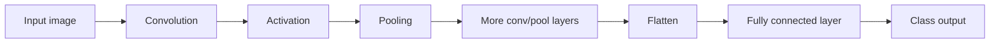

### Convolution

A filter/kernel slides over the input. At each position, element-wise multiplication and summation gives one output value.

Filters learn features such as:
- vertical edges;
- horizontal edges;
- textures;
- color patterns;
- complex objects in deeper layers.

Vertical edges are useful for detecting boundaries that run from top to bottom, such as the side of a car or building. Horizontal edges detect top-bottom changes, such as horizon lines or object bases.

Textures are repeated local patterns, such as rough surface, cloth pattern, or fur-like regions. Color patterns help in RGB images where class information may depend on color.

In deeper CNN layers, simple features combine into complex objects. For example, edges combine into shapes, shapes combine into parts, and parts combine into full objects like faces or vehicles.

### Padding

Padding adds border pixels, usually zeros. It prevents shrinking and preserves edge information.

Without padding, a `6 x 6` image convolved with a `3 x 3` filter becomes `4 x 4`, so repeated convolutions quickly reduce image size. Padding allows the CNN to apply multiple convolutions without losing too much border information.

Same padding:

```text
p = (f - 1) / 2
```

### Stride

Stride controls how far the filter moves at each step. Larger stride gives smaller output.

For stride `1`, the filter moves one pixel at a time and captures detailed information. For stride `2`, it skips one position each time, reducing output size and computation.

### Pooling

Pooling reduces spatial size. Max pooling keeps the maximum value from each window. Pooling does not change depth.

For example, `2 x 2` max pooling with stride `2` changes `28 x 28 x 16` into `14 x 14 x 16`. It reduces computation while keeping the strongest feature response in each region.

## 3.5 CNN Formula Box

```text
Output size = floor((n + 2p - f) / s) + 1
Output depth = number of filters
Conv parameters = (f*f*input_depth + 1 bias) * number_of_filters
Pooling parameters = 0
Flatten size = height * width * depth
Dense parameters = (input_units + 1 bias) * output_units
```

## 3.6 Depth in CNN

Depth means the number of channels/feature maps.

Example:
- grayscale image: `28 x 28 x 1`;
- RGB image: `32 x 32 x 3`;
- if 6 filters are applied, output depth becomes 6.

The filter depth must match input depth. For `32 x 32 x 3`, a `5 x 5` filter is actually `5 x 5 x 3`.

## 3.7 CNN Architectures

### VGG-16

VGG-16 has 16 weight layers. It uses `3 x 3` convolution filters, stride 1, same padding, and `2 x 2` max pooling. It is easy to use for transfer learning but slow to train because it has many parameters.

### ResNet and Skip Connection

ResNet uses identity shortcuts/skip connections.

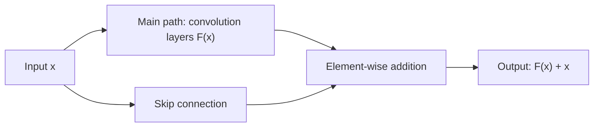

The skip connection helps gradients flow through deep networks, reducing vanishing-gradient difficulty and making very deep networks trainable.

**Important 2024-25 answer:** The addition at the end of a residual block is true element-wise addition, not concatenation.

```text
addition([1,2], [3,4]) = [4,6]
not [1,2,3,4]
```

### 1 x 1 Convolution

A `1 x 1` convolution changes depth while keeping height and width the same. It is used for dimensionality reduction or augmentation.

Example: if input is `64 x 64 x 192` and we apply 32 filters of size `1 x 1`, the output becomes `64 x 64 x 32`. Height and width stay same, but depth is reduced, which lowers later computation.

### Inception Network

Inception uses different filter sizes in parallel, allowing the model to capture local and global patterns efficiently.

Small filters capture local details like edges and small textures, while larger filters capture wider context. Inception combines these parallel outputs so the network can learn multiple feature scales at the same time.

### MobileNet

MobileNet is designed for limited-computation devices. It uses depthwise separable convolution:
- depthwise convolution: filters each input channel separately;
- pointwise convolution: combines channels using `1 x 1` convolution.

Depthwise convolution reduces computation by applying one filter per channel instead of mixing all channels at once. Pointwise convolution then combines these channel-wise features, so MobileNet becomes efficient for smartphones and low-resource devices.

### Transfer Learning

Transfer learning reuses a pre-trained model for a new task.

Process:
1. Start with a pre-trained network.
2. Keep feature-extraction layers.
3. Replace classifier layers.
4. Train classifier on new data.
5. Fine-tune some earlier layers with smaller learning rate.

Starting with a pre-trained network is useful because early CNN layers already know general features like edges, colors, and shapes. For example, a model trained on a large image dataset can be reused for a smaller image classification task.

Feature-extraction layers are kept because they capture reusable visual patterns. Classifier layers are replaced because the new task may have different classes, such as 10 local object classes instead of the original classes.

Fine-tuning means unfreezing some layers and training them slowly using a smaller learning rate. This adapts the pre-trained model to the new dataset without destroying useful old knowledge.

Benefits:
- less data required;
- faster training;
- reduced computation;
- useful when new task is related to old task.

Less data is required because the model already knows basic feature extraction. Faster training happens because only the classifier or a few layers need major updating.

Reduced computation is a benefit because training a large CNN from scratch can take huge time and resources. Transfer learning is most useful when the source and target tasks are related, such as general image classification and medical image classification.

Example: Use a pre-trained image model as feature extractor and replace final classifier for a new set of classes.

---

# 4. Sequence Models: RNN, LSTM, GRU, Encoder-Decoder

## 4.1 Why RNN?

Feedforward neural networks treat each input independently. They do not remember previous inputs. RNNs are designed for sequential data where order matters.

Examples:
- natural language text;
- speech signals;
- stock prices;
- temperature readings;
- time-series analysis.

Natural language is sequential because word order changes meaning. For example, "dog bites man" and "man bites dog" contain the same words but have different meanings.

Speech signals are sequential because the order of sounds decides the spoken word. Time-series data such as stock prices or temperature readings depends on previous values to understand trends.

## 4.2 RNN Architecture

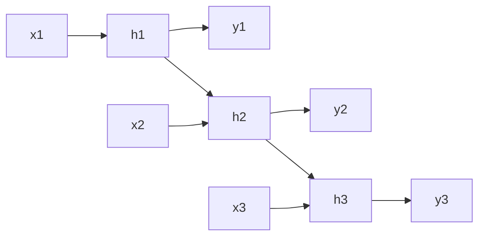

Formula:

```text
h_t = activation(Wxh*x_t + Whh*h_(t-1) + b_h)
y_t = activation(Why*h_t + b_y)
```

## 4.3 Types of RNN by Input-Output Pattern

| Type | Meaning | Application |
|---|---|---|
| One-to-one | One input, one output | Basic classification |
| One-to-many | One input, sequence output | Image captioning |
| Many-to-one | Sequence input, one output | Sentiment/text classification |
| Many-to-many | Sequence input, sequence output | Translation, speech recognition |

One-to-one is like a normal neural network where one input gives one output, such as classifying a single image. It does not heavily use sequence memory.

One-to-many takes one input and produces a sequence. Example: image captioning takes one image and generates a sequence of words as caption.

Many-to-one takes a sequence and produces one output. Example: sentiment classification reads a sentence and outputs positive or negative sentiment.

Many-to-many takes a sequence and produces another sequence. Example: machine translation reads an English sentence and outputs a translated sentence in another language.

## 4.4 Vanishing and Exploding Gradient

In RNN training, gradients pass backward through many time steps. Repeated multiplication can make gradients too small or too large.

| Problem | What happens | Effect |
|---|---|---|
| Vanishing gradient | Gradients become almost zero | Long-term dependencies not learned |
| Exploding gradient | Gradients become very large | Unstable updates, loss becomes abnormal |

Vanishing gradient happens when gradients repeatedly multiply by small values during backpropagation through time. As a result, earlier time steps receive almost no learning signal, so the model forgets long-term context.

Exploding gradient happens when gradients repeatedly multiply by large values. This causes huge weight updates, unstable training, sudden loss spikes, or invalid values.

### How to Know Model Has Exploding Gradients?

Signs:
- loss suddenly becomes very large;
- training becomes unstable;
- weight updates become extremely large;
- model may produce `NaN` values;
- accuracy fluctuates heavily;
- gradients have very high magnitude.

A practical exam example: if training loss is decreasing normally for some epochs and then suddenly becomes extremely large or `NaN`, exploding gradients may be the reason. Very large weight updates are another strong signal.

## 4.5 LSTM

LSTM handles long-term dependencies better than basic RNN.

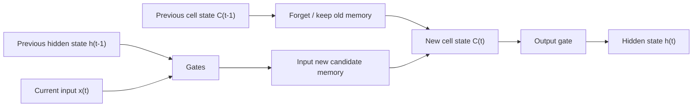

LSTM components:
- cell state: long-term memory;
- hidden state: short-term output memory;
- forget gate;
- input gate;
- output gate.

The cell state acts like a memory highway that carries important information across many time steps. It helps LSTM remember long-term dependencies better than a simple RNN.

The hidden state is the current output-like memory passed to the next time step. It contains short-term information useful for immediate prediction.

The forget gate decides which old information should be removed. The input gate decides what new information should be stored, and the output gate decides what part of memory should become the hidden state.

### Gates

| Gate | Task |
|---|---|
| Forget gate | Decides what previous information to remove |
| Input gate | Decides how much new information to store |
| Output gate | Decides how much memory to send as hidden state |

Forget gate example: in a paragraph, once the subject changes, the model may forget older subject-related information. If the forget gate value is close to `0`, old information is removed.

Input gate example: when a new important word appears, such as a person's name in named entity recognition, the input gate allows this new information to enter memory.

Output gate example: at a particular word position, only part of the memory may be needed for prediction, so the output gate controls what is exposed as hidden state.

## 4.6 GRU

GRU is simpler than LSTM and has fewer parameters.

| Gate | Role |
|---|---|
| Update gate | Controls how much previous hidden state is carried forward |
| Reset gate | Controls how much previous state is ignored |
| Candidate hidden state | New memory candidate |

The update gate works like a memory-retention controller. If the previous context is still useful, the update gate carries more of it forward.

The reset gate decides how much past information should be ignored while forming the new candidate state. This is useful when the sequence enters a new context and old information becomes less relevant.

The candidate hidden state is the proposed new memory formed from current input and selected past information. GRU combines it with old memory based on the update gate.

GRU is faster to train and less prone to overfitting because of fewer parameters.

## 4.7 Encoder-Decoder

Encoder-decoder models are used for sequence-to-sequence tasks where input and output lengths can differ.

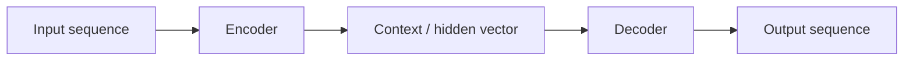

The encoder reads the input sequence and compresses it into a hidden/context vector. The decoder uses that vector to generate output step by step.

Applications:
- machine translation;
- text summarization;
- image captioning;
- speech recognition;
- question answering.

Machine translation is a classic encoder-decoder example: the encoder reads the source sentence, and the decoder generates the translated sentence. Input and output lengths may be different.

Text summarization reads a long document and generates a shorter summary. Image captioning encodes image features and decodes them into a sequence of words.

Speech recognition encodes audio features and decodes the spoken words. Question answering encodes a question/context and decodes or selects the answer.

---

# 5. Transformers, Attention, Embeddings, NLP

## 5.1 Word Embeddings

Text must be converted into numerical vectors.

| Method | Problem / Benefit |
|---|---|
| One-hot encoding | High dimensional, no semantic meaning |
| Word embeddings | Dense, low dimensional, captures similarity |

One-hot encoding represents each word as a long vector with only one `1` and the rest `0`. It does not show meaning; for example, "cat" and "dog" are treated as completely unrelated even though both are animals.

Word embeddings represent words as dense vectors where similar words have similar representations. For example, "king", "queen", "man", and "woman" can have meaningful relationships in vector space.

Word2Vec and GloVe are embedding methods mentioned in the slides.

### Static Embedding Limitation

Static embeddings give the same vector for a word even when meaning changes.

Example:
- "Money in the bank grows" -> financial bank.
- "River bank erodes" -> geographical bank.

In both sentences, a static embedding gives the same vector to "bank", even though the meaning changes. This is a problem for translation, sentiment analysis, and question answering.

Attention creates contextual embeddings, so meaning changes with surrounding words.

## 5.2 Self-Attention

Self-attention lets each word attend to all other words and decide which are important.

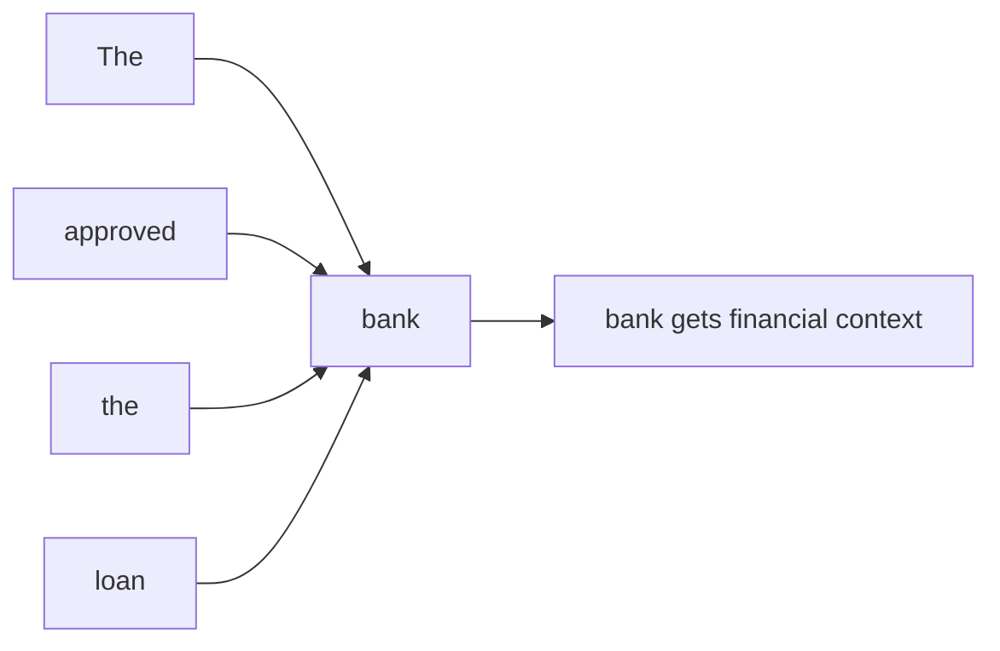

This helps transformers capture long-range dependencies because each token can directly connect to every other token, even if they are far apart in the sequence.

## 5.3 Q, K, V and Scaled Dot-Product Attention

| Symbol | Meaning |
|---|---|
| Q | Query: what the current token is looking for |
| K | Key: what each token offers for matching |
| V | Value: information to be passed forward |

Query represents the current word's requirement. For example, the word "bank" may query surrounding words to understand whether it refers to finance or river side.

Key represents the information available from each word for matching. Words like "loan" and "approved" have keys that match the financial sense of "bank".

Value contains the actual information that will be combined after attention weights are calculated. If a word receives high attention weight, more of its value contributes to the final contextual embedding.

Formula:

```text
score = (Q . K) / sqrt(d_k)
weights = softmax(scores)
output = sum(weights * V)
```

Softmax converts scores into attention weights whose sum is 1.

## 5.4 Multi-Head Attention

Multi-head attention runs multiple attention operations in parallel. Different heads can focus on different relationships in the sentence.

One head may focus on nearby grammar relations, while another head may focus on long-distance meaning. For example, in a long sentence, one head can connect a pronoun to the noun it refers to, while another can focus on action words.

## 5.5 Transformer Block

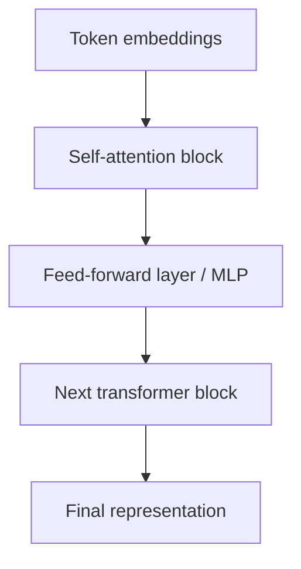

Transformers process sequences in parallel, unlike RNNs which process step by step.

The attention block allows tokens to exchange context with each other. The feed-forward layer then transforms each token representation independently to make it more useful for prediction.

## 5.6 BERT

BERT stands for Bidirectional Encoder Representations from Transformers. It is an encoder-only transformer model used for language understanding. It is pre-trained on large unlabeled text and fine-tuned for tasks like:
- question answering;
- sentiment analysis;
- named entity recognition.

Question answering uses BERT to understand the question and passage, then locate or generate the likely answer. Sentiment analysis uses BERT to classify text as positive, negative, or neutral.

Named entity recognition identifies names of people, places, months, or organizations. For example, in the sentence "April won the match", BERT can use context to understand that "April" is a person, not a month.

Important terms:
- CLS token;
- SEP token;
- segment encoding;
- masked language modeling;
- next sentence prediction.

The CLS token is used as a special representation for classification tasks. For example, in sentiment classification, the final CLS representation can be used to predict positive or negative sentiment.

The SEP token separates two text segments, such as a question and a passage. Segment encoding helps BERT know which token belongs to which sentence or segment.

Masked language modeling trains BERT by hiding some words and asking the model to predict them using context. Next sentence prediction trains it to understand relationships between pairs of sentences.

## 5.7 Deep Learning in NLP and Text Classification

Text classification means assigning text to a category, such as sentiment class or topic class.

Deep learning helps NLP because it learns semantic and contextual features from text automatically.

Models commonly used from the syllabus/decks:
- RNN for sequence processing;
- LSTM for long-term dependencies;
- GRU for efficient sequence learning;
- encoder-decoder for sequence-to-sequence tasks;
- transformers/BERT for contextual understanding.

RNN processes text word by word and keeps a hidden state, so it can model word order. It is useful for simple sequence tasks but struggles with very long dependencies.

LSTM improves RNN by using gates and memory cell, so it can remember important words for a longer time. Example: in sentiment analysis, an LSTM can remember a negative word that appears earlier in a sentence.

GRU is similar to LSTM but simpler, with fewer parameters. It is useful when faster training is needed while still handling sequence information.

Encoder-decoder models are used when input and output are both sequences, such as translation or summarization. Transformers and BERT are stronger for contextual understanding because every word can attend to every other word.

---

# 6. Object Detection

## 6.1 Classification vs Localization vs Detection

| Task | Output |
|---|---|
| Image classification | Class label for whole image |
| Object localization | Class label + one bounding box |
| Object detection | Multiple objects + multiple bounding boxes + classes |

Image classification answers only "what is in the image?" For example, it may classify the whole image as "car" without saying where the car is.

Object localization answers "what is the object and where is it?" It predicts one class and one bounding box around the object.

Object detection handles multiple objects. For example, in a road image it may detect a car, pedestrian, and motorcycle with separate bounding boxes and class labels.

Object detection output:

```text
Y = [Pc, bx, by, bh, bw, c1, c2, c3]
```

Where:
- `Pc`: object probability;
- `bx`, `by`: center of bounding box;
- `bh`, `bw`: height and width;
- `c1, c2, c3`: class probabilities.

`Pc` tells whether an object is present in that grid cell or anchor. If `Pc` is low, the predicted box may be ignored.

`bx` and `by` locate the center of the box, while `bh` and `bw` define its size. Class probabilities such as `c1`, `c2`, and `c3` decide whether the object is a pedestrian, car, motorcycle, or another class.

## 6.2 Sliding Window Algorithm

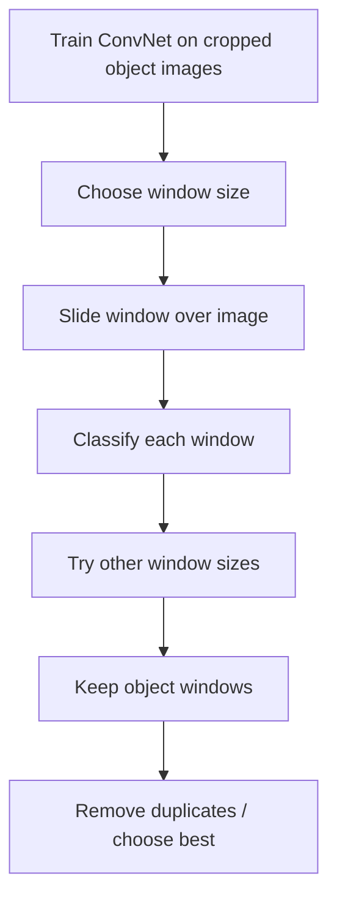

Drawback: the window may not exactly match the object, and checking many windows is computationally expensive.

Example: for car detection, a ConvNet is trained on cropped car images. Then a rectangular window slides across a larger road image; each crop is classified as car or not-car.

Different window sizes are needed because objects may appear small or large. This improves detection but increases computation.

## 6.3 IoU

IoU measures overlap between predicted and actual bounding boxes.

```text
IoU = area of intersection / area of union
```

Higher IoU means better bounding-box accuracy.

Example: if a predicted car box overlaps strongly with the true car box, IoU will be high. If the predicted box barely covers the object, IoU will be low.

## 6.4 Non-Max Suppression

Non-max suppression removes duplicate overlapping predictions by keeping the box with highest confidence and suppressing lower-confidence overlapping boxes.

Example: if three boxes detect the same car, NMS keeps the box with the highest confidence score and removes the others if they overlap too much.

## 6.5 Anchor Boxes

Anchor boxes allow one grid cell to detect multiple objects or objects with different shapes.

For example, one anchor box can be tall and narrow for pedestrians, while another can be wide for cars. This helps the model specialize in different object shapes.

For two anchor boxes:

```text
Y = [Pc,bx,by,bh,bw,c1,c2,c3, Pc,bx,by,bh,bw,c1,c2,c3]
```

Each object is assigned to the grid cell containing its midpoint and the anchor box with highest IoU.

## 6.6 Detection Models

| Type | Method | Examples |
|---|---|---|
| Single-stage | Directly predicts boxes and classes | YOLO, CornerNet, CenterNet |
| Two-stage | Region proposal, then classification/regression | R-CNN, Fast R-CNN, Faster R-CNN, Mask R-CNN |

Single-stage detectors are faster because they predict object boxes and classes in one pass. YOLO is an example where the image is divided into grids and predictions are made directly.

Two-stage detectors first find candidate regions and then classify/refine them. They can be accurate, but they are usually slower because region proposal and classification are separate stages.

### R-CNN Family

| Model | Key idea | Limitation |
|---|---|---|
| R-CNN | Selective search + CNN features + classifier | Very slow |
| Fast R-CNN | Shared CNN + RoI pooling | Still depends on region proposals |
| Faster R-CNN | Region Proposal Network from CNN features | More accurate but time-consuming |

R-CNN generates many region proposals using selective search, then applies CNN feature extraction to each region. This is slow because each proposed region requires separate processing.

Fast R-CNN improves speed by running CNN once on the full image and using RoI pooling for proposed regions. However, it still depends on an external region proposal method.

Faster R-CNN uses a Region Proposal Network to generate proposals directly from CNN features. This makes the process more integrated and trainable end-to-end.

### YOLO

YOLO divides the image into grids and predicts bounding boxes and class probabilities for each grid cell. It is a single-stage detector.

YOLO is useful for faster object detection because it looks at the image only once. For example, in autonomous driving, speed is important for detecting cars and pedestrians quickly.

---

# 7. GAN

GAN has two parts:
- generator;
- discriminator.

The generator creates fake samples from random noise. For example, in image generation, it tries to create an image that looks similar to real training images.

The discriminator receives real samples and generated samples, then predicts whether each sample is real or fake. It acts like a judge that gives feedback to the generator.

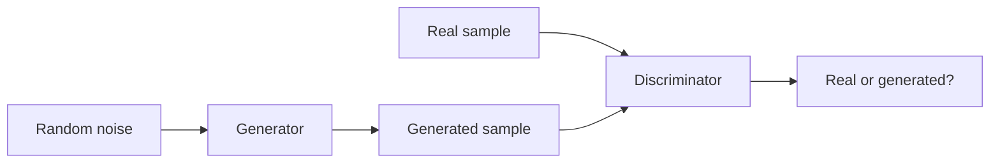

## Generator vs Discriminator Training

| Component | Training goal |
|---|---|
| Generator | Produce samples that fool discriminator |
| Discriminator | Correctly identify real vs generated samples |

The generator is trained to improve fake data quality. If the discriminator says the generated image is fake, the generator updates itself to produce more realistic images next time.

The discriminator is trained like a binary classifier. It learns to output "real" for real samples and "generated" for fake samples.

The discriminator improves by learning to separate real data from generated data. The generator improves by learning to create outputs that the discriminator classifies as real.

Exam sentence:
GAN training is adversarial because the generator and discriminator have opposite goals, and both improve through competition.

---

# 8. Solved Numericals

## 8.1 Dropout Numerical

Question: A layer has 100 neurons. Dropout rate is 0.3. How many neurons are active in each forward pass?

```text
Dropout rate = 0.3
Dropped neurons = 100 * 0.3 = 30
Active neurons = 100 - 30 = 70
```

Answer: `70 neurons`.

## 8.2 Sigmoid Neuron Numerical

Question: `x = 0.9`, `w = -0.6`, `b = 0.2`, sigmoid activation. Compute weighted sum and output. Then change `w = -0.3`.

Case 1:

```text
z = wx + b
z = (-0.6)(0.9) + 0.2
z = -0.54 + 0.2 = -0.34

a = 1 / (1 + e^-z)
a = 1 / (1 + e^0.34)
a = 0.4158
```

Case 2:

```text
z = (-0.3)(0.9) + 0.2
z = -0.27 + 0.2 = -0.07

a = sigmoid(-0.07) = 0.4825
```

Conclusion: When weight increases from `-0.6` to `-0.3`, output increases from about `0.416` to `0.483`.

## 8.3 Learning Rate Numerical

Question: Initial weight `w = 0.4`, gradient `dE/dw = -0.1`. Compare learning rates `eta1 = 0.01` and `eta2 = 0.1`.

Update rule:

```text
w_new = w - eta * gradient
```

For `eta = 0.01`:

```text
w_new = 0.4 - 0.01(-0.1)
w_new = 0.401
```

For `eta = 0.1`:

```text
w_new = 0.4 - 0.1(-0.1)
w_new = 0.41
```

Answer: `eta = 0.1` gives faster weight update because it produces a larger change.

## 8.4 Logistic Regression One-Step Update

Given:

```text
x = [1, 2]
w = [0.1, -0.2]
b = 0
y = 1
alpha = 0.1
```

Forward:

```text
z = 0.1(1) + (-0.2)(2) + 0 = -0.3
a = sigmoid(-0.3) = 0.4256
```

Backward:

```text
dz = a - y = -0.5744
dw1 = dz*x1 = -0.5744
dw2 = dz*x2 = -1.1488
db = -0.5744
```

Update:

```text
w1 = 0.1 - 0.1(-0.5744) = 0.1574
w2 = -0.2 - 0.1(-1.1488) = -0.0851
b = 0 - 0.1(-0.5744) = 0.0574
```

## 8.5 CNN Numerical from 2023-24 Paper

Given:

```text
Input = 28 x 28 x 1
Conv1: k=16, f=5, s=1, p=2
Pool1: f=2, s=2
Conv2: k=32, f=5, s=1, p=2
Pool2: f=2, s=2
Classes = 10
```

| Layer | Calculation | Output shape | Parameters |
|---|---|---:|---:|
| Conv1 | `(28+4-5)/1 + 1 = 28` | `28 x 28 x 16` | `(5*5*1+1)*16 = 416` |
| Pool1 | `(28-2)/2 + 1 = 14` | `14 x 14 x 16` | 0 |
| Conv2 | `(14+4-5)/1 + 1 = 14` | `14 x 14 x 32` | `(5*5*16+1)*32 = 12,832` |
| Pool2 | `(14-2)/2 + 1 = 7` | `7 x 7 x 32` | 0 |
| Flatten | `7*7*32` | `1568` | 0 |
| FC | `1568 -> 10` | `10` | `(1568+1)*10 = 15,690` |

Total parameters including FC:

```text
416 + 12,832 + 15,690 = 28,938
```

## 8.6 CNN Numerical from 2024-25 Paper

Given:

```text
Input = 32 x 32 x 3 color image
Conv1: k=6, f=5, s=1, p=0
Pool1: f=2, s=2
Conv2: k=10, f=5, s=1, p=0
Pool2: f=2, s=2
Classes = 10
```

Formula:

```text
Output size = floor((n + 2p - f)/s) + 1
```

| Layer | Calculation | Output shape | Parameters |
|---|---|---:|---:|
| Conv1 | `(32+0-5)/1 + 1 = 28` | `28 x 28 x 6` | `(5*5*3+1)*6 = 456` |
| Pool1 | `(28-2)/2 + 1 = 14` | `14 x 14 x 6` | 0 |
| Conv2 | `(14+0-5)/1 + 1 = 10` | `10 x 10 x 10` | `(5*5*6+1)*10 = 1,510` |
| Pool2 | `(10-2)/2 + 1 = 5` | `5 x 5 x 10` | 0 |
| Flatten | `5*5*10` | `250` | 0 |
| FC | `250 -> 10` | `10` | `(250+1)*10 = 2,510` |

Total parameters including FC:

```text
456 + 1,510 + 2,510 = 4,476
```

The question specifically asks to mention FC parameters:

```text
FC parameters = 2,510
```

## 8.7 RNN Forward Numerical

Given:

```text
W_xh = 0.5
W_hh = 0.2
h0 = 0
x1 = 1
x2 = 2
W_hy = 1
```

Use:

```text
h_t = tanh(W_xh*x_t + W_hh*h_(t-1))
y_t = sigmoid(W_hy*h_t)
```

At `t=1`:

```text
h1 = tanh(0.5*1 + 0.2*0) = tanh(0.5) = 0.4621
y1 = sigmoid(0.4621) = 0.6135
```

At `t=2`:

```text
h2 = tanh(0.5*2 + 0.2*0.4621)
h2 = tanh(1.0924) = 0.7978
y2 = sigmoid(0.7978) = 0.6895
```

## 8.8 LSTM Gate Numerical

Given:

```text
C(t-1) = 0.4
f_t = 0.8
i_t = 0.6
C~_t = 0.5
o_t = 0.7
```

Cell state:

```text
C_t = f_t*C(t-1) + i_t*C~_t
C_t = 0.8(0.4) + 0.6(0.5)
C_t = 0.62
```

Hidden state:

```text
h_t = o_t*tanh(C_t)
h_t = 0.7*tanh(0.62)
h_t = 0.386
```

## 8.9 Attention Numerical: Single Key-Value

Given:

```text
Q = [2,1], K = [1,3], V = [4,2], d_k = 2
```

```text
Q.K = 2(1) + 1(3) = 5
score = 5 / sqrt(2) = 3.536
```

Since there is only one value vector:

```text
attention output = [4,2]
```

## 8.10 Attention Numerical: Multiple Keys

Given:

```text
Q = [2,1]
K1 = [1,0], K2 = [0,2], K3 = [1,1]
V1 = [3,1], V2 = [2,4], V3 = [5,2]
d_k = 2
```

Scores:

```text
s1 = 2/sqrt(2) = 1.414
s2 = 2/sqrt(2) = 1.414
s3 = 3/sqrt(2) = 2.121
```

Softmax weights:

```text
w1 = 0.248
w2 = 0.248
w3 = 0.503
```

Output:

```text
0.248[3,1] + 0.248[2,4] + 0.503[5,2]
= [3.76, 2.248]
```

---

# 9. Exam-Ready Long Answers

## 9.1 Compare GD, SGD, and Mini-Batch GD

Gradient descent updates parameters to minimize loss. In batch gradient descent, gradients are calculated using the entire training set, so updates are stable but slow. In stochastic gradient descent, gradients are calculated using one training example at a time, so updates are faster but noisy. Mini-batch gradient descent uses a small batch of examples, giving a balance between stability and speed. Mini-batch GD is widely used in deep learning because large datasets make full-batch training expensive.

## 9.2 Explain Batch Normalization

Batch normalization is a technique that normalizes activations of a layer within a mini-batch. It calculates batch mean and variance, normalizes the activation values, and then applies learnable scale and shift using gamma and beta. It reduces internal covariate shift, stabilizes activation distributions, improves gradient flow, reduces sensitivity to initialization, and speeds up training.

## 9.3 Explain Transfer Learning with Example

Transfer learning means using knowledge learned by a model on one task for another related task. A pre-trained image model may already know edges, textures, shapes, and object parts. For a new classification task, we can keep earlier feature-extraction layers, replace the final classifier, train the new classifier, and optionally fine-tune some layers with a smaller learning rate. Benefits include reduced training time, less data requirement, lower computational cost, and better performance when the new dataset is small.

## 9.4 Explain Attention Long-Range Dependency

Traditional RNNs process tokens step by step, so information from early tokens may weaken over long sequences. Transformers use self-attention, where each token can directly compare itself with every other token through attention scores. This direct connection helps capture long-range dependencies. For example, in a long sentence, a word near the end can attend to a related word near the beginning without passing through many recurrent steps.

## 9.5 Explain Sliding Window Object Detection

Sliding window detection trains a ConvNet on cropped object images. During detection, a window of fixed size is moved across the image. Each window is passed through the ConvNet to decide whether it contains the object. The process is repeated for different window sizes. The detected boxes are stored, and overlapping boxes can be filtered by keeping the highest-confidence one. Its drawback is poor localization accuracy and high computation.

## 9.6 Explain Generator and Discriminator Training

In GAN, the generator creates fake samples from random noise. The discriminator receives both real and generated samples and predicts whether each is real or fake. The discriminator is trained to correctly classify real and generated samples. The generator is trained to fool the discriminator into classifying generated samples as real. Thus, both models improve through adversarial training.

---

# 10. Practice Bank Based on Both Papers

## 2-Mark Practice

1. In what way is logistic regression a simplified neural network?
2. If dropout rate is `0.3` and a layer has 100 neurons, how many are active?
3. Define internal covariate shift.
4. What is the role of gamma and beta in batch normalization?
5. Define stride in CNN.
6. Define padding in CNN.
7. What is depth in CNN?
8. What is transfer learning?
9. What is an identity shortcut in ResNet?
10. Is residual-block addition element-wise addition or concatenation?
11. What is object detection?
12. How does object detection differ from image classification?
13. What are anchor boxes?
14. What is IoU?
15. Name two applications of RNN.
16. What is the role of encoder in encoder-decoder architecture?
17. What is the role of decoder in encoder-decoder architecture?
18. What are Q, K, and V in attention?
19. What is BERT?
20. Name deep learning models used in NLP text classification.

## 4-Mark Practice

1. A model has 99% training accuracy and 75% testing accuracy. Which hyperparameter tuning techniques can help?
2. Explain batch normalization and how it improves performance.
3. Explain transfer learning with benefits.
4. Compare L1 and L2 regularization.
5. Explain how dropout differs from L1 and L2 regularization.
6. Explain encoder-decoder architecture for sequence-to-sequence tasks.
7. Explain GAN generator and discriminator training.
8. Explain how attention captures long-range dependencies.
9. Explain object detection and sliding-window algorithm.
10. How do you know a model is suffering from exploding gradients?

## 6-Mark Practice

1. Compare gradient descent, stochastic gradient descent, and mini-batch gradient descent.
2. Analyze why Adam may converge faster than SGD.
3. Calculate a CNN architecture for a 32x32 color image with given layers.
4. Explain logistic regression as a neural network with formula and diagram.
5. Explain LSTM architecture with gates.
6. Illustrate RNN architecture with applications and gradient problems.
7. Explain CNN layers and calculate output shapes.
8. Explain ResNet skip connection and its role in training deeper networks.

## Numerical Practice

1. `x=0.9`, `w=-0.6`, `b=0.2`. Compute sigmoid output. Repeat for `w=-0.3`.
2. `w=0.4`, gradient `=-0.1`. Compute updated weights for learning rates `0.01` and `0.1`.
3. Input `32 x 32 x 3`, Conv1 `k=6, f=5, s=1, p=0`, Pool1 `f=2,s=2`, Conv2 `k=10, f=5, s=1,p=0`, Pool2 `f=2,s=2`. Calculate all shapes and FC parameters.
4. Input `28 x 28 x 1`, Conv1 `k=16, f=5, s=1,p=2`, Pool1, Conv2 `k=32,f=5,s=1,p=2`, Pool2. Calculate shapes and parameters.
5. Given `Q=[1,2]`, `K=[3,1]`, `V=[2,5]`, `d_k=2`, compute attention score and output.
6. Given LSTM gate values, calculate new cell state and hidden state.

---

# 11. One-Page Last-Minute Sheet

## Formula Box

```text
Neuron: z = wTx + b
Sigmoid: 1 / (1 + e^-z)
Loss: -[y log(a) + (1-y) log(1-a)]
Gradient update: w_new = w - eta*gradient
Dropout active neurons = total neurons * (1 - dropout rate)
CNN output = floor((n + 2p - f)/s) + 1
Conv params = (f*f*input_depth + 1) * filters
FC params = (input_units + 1) * output_units
RNN: h_t = activation(Wxh*x_t + Whh*h_(t-1) + b)
LSTM: C_t = f_t*C(t-1) + i_t*C~_t
Attention score = (Q.K) / sqrt(d_k)
IoU = intersection / union
```

## Most Repeated / Most Likely Topics

| Must Prepare | Why |
|---|---|
| CNN calculations | Appears in both papers |
| Optimizers | Strong focus in 2024-25 |
| Batch normalization | Appears directly in both |
| Logistic regression and sigmoid | Appears directly in both |
| Dropout and regularization | Numericals + theory |
| RNN/LSTM/gradient problems | Repeated sequence-model focus |
| Attention | Transformer question trend |
| Object detection/sliding window/anchors | Repeated final-unit area |
| Transfer learning | Appears in both |
| GAN | Appears in both |

CNN calculations should be practiced step by step: write the formula, calculate each layer output, mention depth, then calculate parameters. Both question papers contain CNN numerical questions, so this is a scoring area.

Optimizers should be prepared as a comparison answer. Write how GD, SGD, mini-batch, momentum, RMSProp, and Adam differ in update style, speed, stability, and convergence.

Batch normalization should be written with internal covariate shift, mean/variance normalization, gamma-beta scaling, and training benefits. This topic can appear as either theory or short explanation.

Logistic regression and sigmoid should be prepared with formula and numerical practice. A common exam style is to give `x`, `w`, and `b`, then ask for weighted sum and sigmoid output.

Dropout and regularization should be explained as overfitting-control methods. Include examples like dropout `0.3` keeping 70% neurons active and L2 reducing large weights.

RNN/LSTM/gradient problems should be prepared with diagrams. For RNN, explain sequence memory; for LSTM, explain gates; for gradients, write symptoms of vanishing and exploding gradients.

Attention should be prepared with Q, K, V and one numerical. Also explain that attention captures long-range dependency because each token can directly attend to every other token.

Object detection should be prepared by comparing classification, localization, and detection. Add sliding window, IoU, non-max suppression, anchor boxes, and YOLO/R-CNN examples.

Transfer learning should be explained with the pre-trained model workflow: keep feature extractor, replace classifier, train new classifier, and fine-tune if needed.

GAN should be written as generator versus discriminator training. The generator creates fake samples, while the discriminator learns to classify real and generated samples.

## Diagram Checklist

Practice drawing:
- artificial neuron;
- logistic regression as shallow NN;
- forward/backward propagation;
- batch normalization flow;
- CNN pipeline;
- residual block;
- RNN unrolled through time;
- LSTM cell;
- encoder-decoder;
- transformer block;
- sliding-window object detection;
- anchor boxes and bounding box.

For diagrams, label every arrow and component. A simple labelled diagram with 2-3 explanatory lines is better than a complex unlabelled diagram in a theory exam.

For CNN diagrams, show input, convolution, pooling, flattening, fully connected layer, and output classes. For LSTM, show forget gate, input gate, output gate, cell state, and hidden state.

For object detection diagrams, show a bounding box around an object and label `bx`, `by`, `bh`, and `bw`. For anchor boxes, draw two different shapes to show how one grid cell can handle different object shapes.
