# Deep Learning ESE Study Material - Enhanced Revision Edition

**Prepared from your supplied material only**

Sources used:
- `Syllabus.pdf`
- `Unit 01.pptx` to `Unit 06.pptx`
- `Deep Learning_ESE Question paper format  AY 23-24.pdf`
- `Deep Learning_ESE Question paperAY 24-25 (2).pdf`

---

## 0. Exam Map

### Paper Pattern Snapshot

| Area | 2023-24 Paper | 2024-25 Paper | Priority |
|---|---|---|---|
| Logistic regression / ANN basics | Activation functions, GridSearchCV, ANN forward-backward pass | Logistic regression as simplified NN, sigmoid numerical, learning-rate numerical | Very high |
| Optimization | Gradient descent, SGD comparison | SGD vs Adam convergence, GD vs SGD vs mini-batch | Very high |
| Overfitting control | Batch norm, L2, data augmentation, transfer learning | Dropout numerical, hyperparameter tuning, L1/L2/dropout comparison | Very high |
| CNN | 28x28 grayscale CNN calculation | 32x32 color CNN calculation, FC parameters | Very high |
| Sequence models | LSTM, RNN vanishing/exploding gradient | Encoder-decoder, RNN types, exploding gradient symptoms | Very high |
| Transformers | Attention models | Attention long-range dependency | High |
| Object detection | Bounding boxes, anchor boxes | Classification vs detection, sliding window | High |
| Advanced CNN | ResNet, Inception | ResNet identity shortcut and element-wise addition | Medium-high |
| GAN | Generator/discriminator working | Training difference of generator and discriminator | Medium-high |
| NLP | Text analysis in syllabus | Text classification and DL models | Medium |

### 10-Day Smart Revision Order

| Day | Main Target | Numericals |
|---|---|---|
| 1 | Logistic regression, neuron, activation, loss | Sigmoid output, one-step weight update |
| 2 | Gradient descent, SGD, mini-batch, momentum, RMSProp, Adam | Learning-rate update |
| 3 | Overfitting, L1/L2, dropout, batch normalization | Dropout active-neuron count |
| 4 | CNN basics: convolution, padding, stride, pooling | 28x28 and 32x32 CNN dimensions |
| 5 | CNN architectures: VGG, ResNet, Inception, MobileNet, transfer learning | 1x1 convolution parameters |
| 6 | RNN, sequence data, vanishing/exploding gradient | Basic RNN forward calculation |
| 7 | LSTM, GRU, encoder-decoder | LSTM gate calculation |
| 8 | Embeddings, self-attention, transformer, BERT | Attention score/output |
| 9 | Object detection: sliding window, IoU, NMS, anchors, R-CNN, YOLO | IoU and anchor-output vector |
| 10 | Full paper practice | Mixed numericals |

---

# 1. Foundations of Neural Networks

## 1.1 Why Deep Learning?

Deep learning is useful for complex problems with large unstructured data such as images, text, audio, speech, and time-series data. The main advantage is that deep networks learn features automatically through layers, instead of depending only on manually designed features.

### Machine Learning vs Deep Learning

| Point | Machine Learning | Deep Learning |
|---|---|---|
| Feature extraction | Often manual | Automatic through layers |
| Data type | Works well with structured data | Strong for image, text, audio |
| Model depth | Usually shallow | Multiple hidden layers |
| Data need | Can work with smaller data | Usually needs larger data |
| Computation | Comparatively lower | Higher |

**Exam line:** Deep learning is preferred when data is large, complex, and unstructured because it can learn hierarchical features automatically.

## 1.2 Biological Neuron to Artificial Neuron

| Biological term | Artificial NN equivalent |
|---|---|
| Dendrites | Inputs |
| Synapse | Connection |
| Synaptic weight | Weight |
| Cell body | Processing unit |
| Axon | Output |

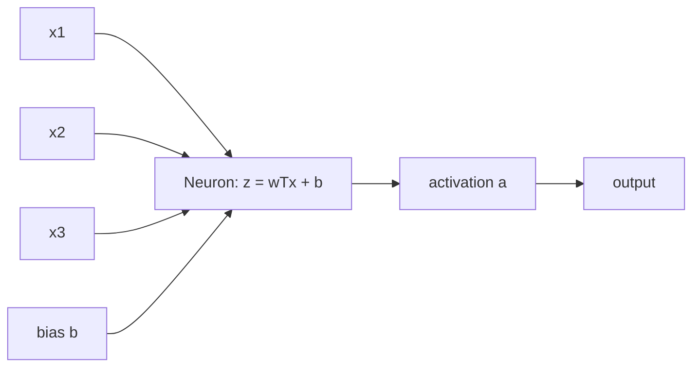

For an artificial neuron:

```text
z = w1x1 + w2x2 + ... + wnxn + b
a = activation(z)
```

Weights decide the strength of each input. Bias shifts the activation threshold. The activation function decides whether and how much the neuron fires.

## 1.3 Logistic Regression as a Simplified Neural Network

Logistic regression is a shallow neural network because it has:
- input features;
- weights and bias;
- weighted sum calculation;
- sigmoid activation;
- output probability.

It does not have multiple hidden layers, so it is a simplified neural network.

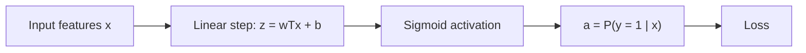

### Important Formula Set

```text
z = wTx + b
a = sigmoid(z) = 1 / (1 + e^-z)
L(a,y) = -[y log(a) + (1-y) log(1-a)]
J = average of all losses
```

### How to Write in Exam

Logistic regression is used for binary classification. It accepts input vector `x`, computes a weighted sum `z = wTx + b`, applies sigmoid activation to produce probability `a`, and compares this with actual class `y` using binary cross-entropy loss. Since it has the same basic components as a neural network, it is considered a simplified/shallow neural network.

## 1.4 Activation Functions

Activation functions introduce non-linearity. Without activation functions, even a deep network would behave like a linear model.

| Activation | Output range | Use |
|---|---:|---|
| Unipolar binary | 0 or 1 | Simple threshold output |
| Bipolar binary | -1 or 1 | Binary decision with bipolar output |
| Sigmoid | 0 to 1 | Binary classification probability |
| Non-linear activations | Depends on function | Hidden layers for complex patterns |

### Choosing Activation Functions

Choose based on:
- output range needed;
- task type;
- gradient behavior;
- training stability;
- whether the layer is hidden or output.

For binary classification output, sigmoid is suitable because it gives a probability between 0 and 1. Hidden layers need non-linear activation so the network can learn complex relations.

## 1.5 Forward and Backward Propagation

Forward propagation computes predictions. Backward propagation computes gradients and updates weights to reduce loss.

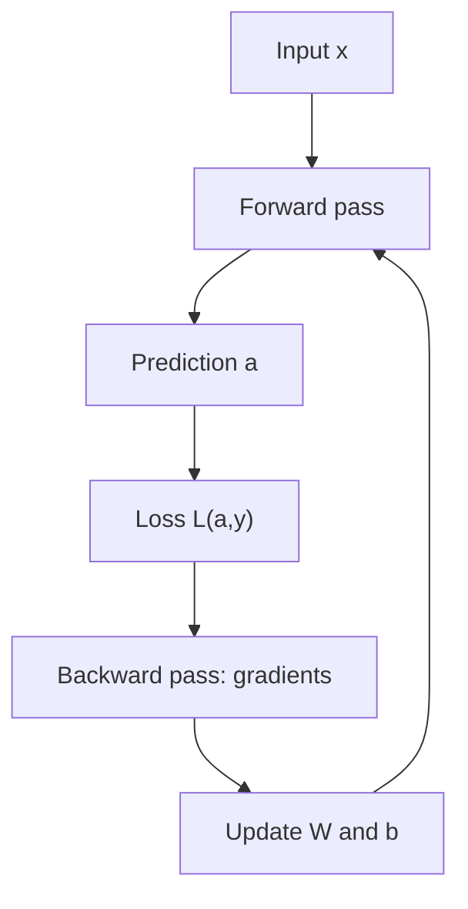

For sigmoid output with binary cross-entropy:

```text
dz = a - y
dW = dz * x
db = dz
W = W - alpha*dW
b = b - alpha*db
```

---

# 2. Training Challenges and Improvements

## 2.1 Overfitting

Overfitting means the model performs very well on training data but poorly on unseen/test data.

Example from 2024-25 paper:

```text
Training accuracy = 99%
Testing accuracy = 75%
```

This indicates overfitting because the model has memorized training patterns but has not generalized well.

### Remedies

| Method | How it helps |
|---|---|
| Data augmentation | Increases training variety |
| Early stopping | Stops training before validation performance worsens |
| L1/L2 regularization | Penalizes large/complex weights |
| Dropout | Randomly disables neurons during training |
| Batch normalization | Stabilizes layer activations |
| Hyperparameter tuning | Finds better model settings |

## 2.2 Hyperparameter Tuning

Hyperparameters are selected before training. Examples:
- learning rate;
- number of layers;
- number of neurons;
- dropout rate;
- batch size;
- epochs;
- optimizer;
- regularization parameter.

For poor generalization, tune:
- dropout rate;
- L1/L2 regularization strength;
- learning rate;
- number of layers/neurons;
- batch size;
- early stopping patience;
- optimizer.

### GridSearchCV Style Explanation

Grid search tries all combinations from a predefined set. Each combination is trained/evaluated, and the best one is selected based on validation performance.

```text
learning_rate = [0.01, 0.001]
dropout = [0.2, 0.3, 0.5]
optimizer = [SGD, Adam]
```

The model tests combinations and chooses the one giving better generalization.

## 2.3 Regularization

Regularization adds a penalty term to reduce model complexity.

```text
Cost = Loss + Regularization term
```

### L1 vs L2 vs Dropout

| Technique | Main idea | Effect |
|---|---|---|
| L1 | Penalizes absolute weights | Can make weights exactly zero; useful for compression |
| L2 | Penalizes squared weights | Shrinks weights toward zero; common weight decay |
| Dropout | Randomly removes neurons during training | Prevents dependence on specific neurons |

**Key difference:** L1/L2 modify the cost function using a penalty term. Dropout changes the network structure temporarily during each training iteration.

## 2.4 Dropout

Dropout randomly removes neurons and their incoming/outgoing connections during training. This forces the network to learn more robust features.

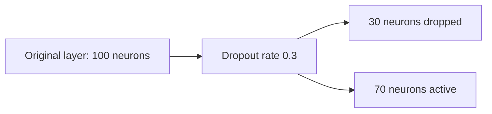

If dropout rate is `0.3`, active fraction is:

```text
1 - 0.3 = 0.7
```

For 100 neurons:

```text
Active neurons = 100 * 0.7 = 70
```

## 2.5 Batch Normalization

Batch normalization normalizes activations inside a mini-batch. It reduces internal covariate shift, stabilizes training, and speeds convergence.

### Internal Covariate Shift

As data moves through multiple layers, activation distributions keep changing because weights and biases are updated. This moving distribution makes learning difficult.

### Batch Norm Steps

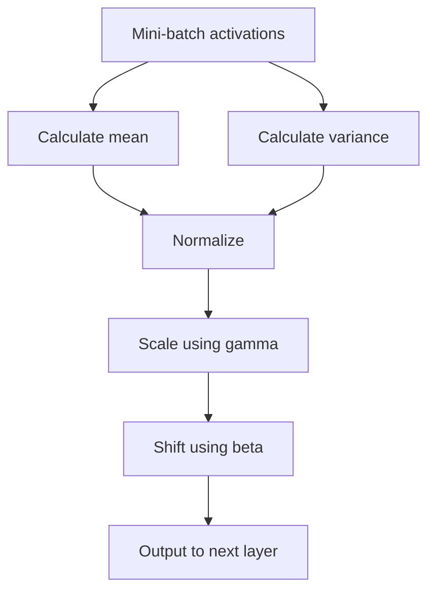

Important parameters:
- `gamma`: learnable scale;
- `beta`: learnable shift;
- moving mean and moving variance: saved state.

Exam answer:
Batch normalization improves performance by keeping activations on a stable scale, reducing internal covariate shift, helping gradients flow better, allowing faster convergence, and reducing sensitivity to poor initialization.

## 2.6 Optimizers

Optimizers decide how weights and biases are updated to minimize loss.

### Gradient Descent Variants

| Method | Gradient computed using | Update frequency | Strength | Weakness |
|---|---|---|---|---|
| Batch GD | Entire dataset | Once per epoch | Stable | Slow for large data |
| SGD | One sample | Very frequent | Faster updates | Noisy path |
| Mini-batch GD | Small batch | Frequent | Balance of speed/stability | Batch size must be chosen |

### SGD vs Adam Convergence

From the 2024-25 paper:
- Model A uses SGD with learning rate `0.01`;
- Model B uses Adam with learning rate `0.001`;
- Model A converges slowly but Model B converges faster.

Reason:
SGD uses a more direct gradient update and can move slowly or noisily depending on learning rate and gradient direction. Adam combines momentum-like behavior with adaptive learning-rate ideas, so it can adjust updates more effectively for each parameter and often converges faster.

### Momentum

Momentum uses exponentially weighted averages of gradients:

```text
VdW = beta*VdW + (1-beta)*dW
Vdb = beta*Vdb + (1-beta)*db
W = W - alpha*VdW
b = b - alpha*Vdb
```

It smooths oscillations and helps faster movement in useful directions.

### RMSProp

RMSProp adapts learning rates using a moving average of squared gradients. It improves convergence stability.

### Adam

Adam combines the benefit of momentum and adaptive learning-rate behavior. That is why it often trains faster than plain SGD.

---

# 3. CNN and Image Processing

## 3.1 Image Representation

Images are converted into numbers before being processed:

| Representation | Meaning |
|---|---|
| Grayscale | One intensity value per pixel |
| RGB | Red, green, blue values per pixel |
| Feature extraction | Edges, corners, textures, CNN features |
| Histogram | Frequency distribution of pixel intensities |

## 3.2 Image Preprocessing

| Technique | Purpose |
|---|---|
| Resizing | Uniform input size |
| Grayscaling | Reduces computation |
| Binarization | Converts to black/white using threshold |
| Contrast enhancement | Improves visual distinction |
| Noise reduction | Removes unwanted noise |
| Normalization | Brings pixel values to useful range |

## 3.3 Why CNN Instead of Fully Connected NN?

A large image creates huge input size. Example from slides: a `1000 x 1000 x 3` image gives 3 million input features. A fully connected hidden layer with 1000 neurons would require about 3 billion weights. CNN uses shared filters, so it learns local features with far fewer parameters.

## 3.4 CNN Building Blocks

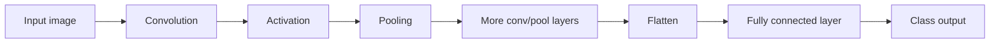

### Convolution

A filter/kernel slides over the input. At each position, element-wise multiplication and summation gives one output value.

Filters learn features such as:
- vertical edges;
- horizontal edges;
- textures;
- color patterns;
- complex objects in deeper layers.

### Padding

Padding adds border pixels, usually zeros. It prevents shrinking and preserves edge information.

Same padding:

```text
p = (f - 1) / 2
```

### Stride

Stride controls how far the filter moves at each step. Larger stride gives smaller output.

### Pooling

Pooling reduces spatial size. Max pooling keeps the maximum value from each window. Pooling does not change depth.

## 3.5 CNN Formula Box

```text
Output size = floor((n + 2p - f) / s) + 1
Output depth = number of filters
Conv parameters = (f*f*input_depth + 1 bias) * number_of_filters
Pooling parameters = 0
Flatten size = height * width * depth
Dense parameters = (input_units + 1 bias) * output_units
```

## 3.6 Depth in CNN

Depth means the number of channels/feature maps.

Example:
- grayscale image: `28 x 28 x 1`;
- RGB image: `32 x 32 x 3`;
- if 6 filters are applied, output depth becomes 6.

The filter depth must match input depth. For `32 x 32 x 3`, a `5 x 5` filter is actually `5 x 5 x 3`.

## 3.7 CNN Architectures

### VGG-16

VGG-16 has 16 weight layers. It uses `3 x 3` convolution filters, stride 1, same padding, and `2 x 2` max pooling. It is easy to use for transfer learning but slow to train because it has many parameters.

### ResNet and Skip Connection

ResNet uses identity shortcuts/skip connections.

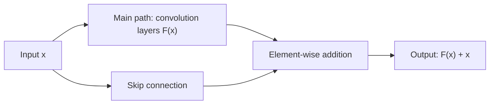

The skip connection helps gradients flow through deep networks, reducing vanishing-gradient difficulty and making very deep networks trainable.

**Important 2024-25 answer:** The addition at the end of a residual block is true element-wise addition, not concatenation.

```text
addition([1,2], [3,4]) = [4,6]
not [1,2,3,4]
```

### 1 x 1 Convolution

A `1 x 1` convolution changes depth while keeping height and width the same. It is used for dimensionality reduction or augmentation.

### Inception Network

Inception uses different filter sizes in parallel, allowing the model to capture local and global patterns efficiently.

### MobileNet

MobileNet is designed for limited-computation devices. It uses depthwise separable convolution:
- depthwise convolution: filters each input channel separately;
- pointwise convolution: combines channels using `1 x 1` convolution.

### Transfer Learning

Transfer learning reuses a pre-trained model for a new task.

Process:
1. Start with a pre-trained network.
2. Keep feature-extraction layers.
3. Replace classifier layers.
4. Train classifier on new data.
5. Fine-tune some earlier layers with smaller learning rate.

Benefits:
- less data required;
- faster training;
- reduced computation;
- useful when new task is related to old task.

Example: Use a pre-trained image model as feature extractor and replace final classifier for a new set of classes.

---

# 4. Sequence Models: RNN, LSTM, GRU, Encoder-Decoder

## 4.1 Why RNN?

Feedforward neural networks treat each input independently. They do not remember previous inputs. RNNs are designed for sequential data where order matters.

Examples:
- natural language text;
- speech signals;
- stock prices;
- temperature readings;
- time-series analysis.

## 4.2 RNN Architecture

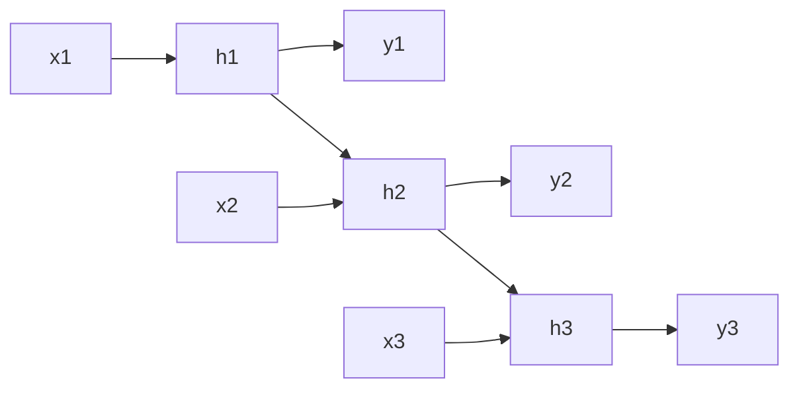

Formula:

```text
h_t = activation(Wxh*x_t + Whh*h_(t-1) + b_h)
y_t = activation(Why*h_t + b_y)
```

## 4.3 Types of RNN by Input-Output Pattern

| Type | Meaning | Application |
|---|---|---|
| One-to-one | One input, one output | Basic classification |
| One-to-many | One input, sequence output | Image captioning |
| Many-to-one | Sequence input, one output | Sentiment/text classification |
| Many-to-many | Sequence input, sequence output | Translation, speech recognition |

## 4.4 Vanishing and Exploding Gradient

In RNN training, gradients pass backward through many time steps. Repeated multiplication can make gradients too small or too large.

| Problem | What happens | Effect |
|---|---|---|
| Vanishing gradient | Gradients become almost zero | Long-term dependencies not learned |
| Exploding gradient | Gradients become very large | Unstable updates, loss becomes abnormal |

### How to Know Model Has Exploding Gradients?

Signs:
- loss suddenly becomes very large;
- training becomes unstable;
- weight updates become extremely large;
- model may produce `NaN` values;
- accuracy fluctuates heavily;
- gradients have very high magnitude.

## 4.5 LSTM

LSTM handles long-term dependencies better than basic RNN.

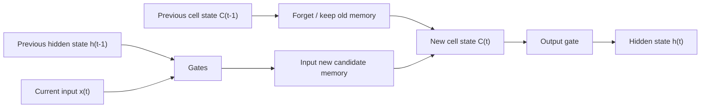

LSTM components:
- cell state: long-term memory;
- hidden state: short-term output memory;
- forget gate;
- input gate;
- output gate.

### Gates

| Gate | Task |
|---|---|
| Forget gate | Decides what previous information to remove |
| Input gate | Decides how much new information to store |
| Output gate | Decides how much memory to send as hidden state |

## 4.6 GRU

GRU is simpler than LSTM and has fewer parameters.

| Gate | Role |
|---|---|
| Update gate | Controls how much previous hidden state is carried forward |
| Reset gate | Controls how much previous state is ignored |
| Candidate hidden state | New memory candidate |

GRU is faster to train and less prone to overfitting because of fewer parameters.

## 4.7 Encoder-Decoder

Encoder-decoder models are used for sequence-to-sequence tasks where input and output lengths can differ.

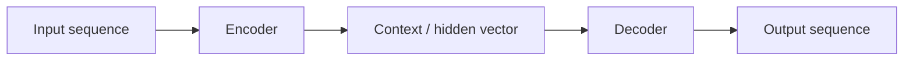

The encoder reads the input sequence and compresses it into a hidden/context vector. The decoder uses that vector to generate output step by step.

Applications:
- machine translation;
- text summarization;
- image captioning;
- speech recognition;
- question answering.

---

# 5. Transformers, Attention, Embeddings, NLP

## 5.1 Word Embeddings

Text must be converted into numerical vectors.

| Method | Problem / Benefit |
|---|---|
| One-hot encoding | High dimensional, no semantic meaning |
| Word embeddings | Dense, low dimensional, captures similarity |

Word2Vec and GloVe are embedding methods mentioned in the slides.

### Static Embedding Limitation

Static embeddings give the same vector for a word even when meaning changes.

Example:
- "Money in the bank grows" -> financial bank.
- "River bank erodes" -> geographical bank.

Attention creates contextual embeddings, so meaning changes with surrounding words.

## 5.2 Self-Attention

Self-attention lets each word attend to all other words and decide which are important.

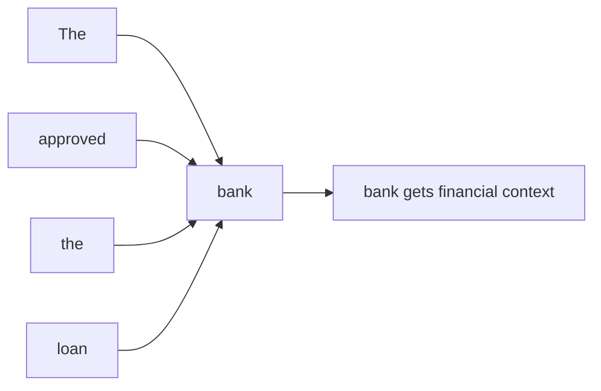

This helps transformers capture long-range dependencies because each token can directly connect to every other token, even if they are far apart in the sequence.

## 5.3 Q, K, V and Scaled Dot-Product Attention

| Symbol | Meaning |
|---|---|
| Q | Query: what the current token is looking for |
| K | Key: what each token offers for matching |
| V | Value: information to be passed forward |

Formula:

```text
score = (Q . K) / sqrt(d_k)
weights = softmax(scores)
output = sum(weights * V)
```

Softmax converts scores into attention weights whose sum is 1.

## 5.4 Multi-Head Attention

Multi-head attention runs multiple attention operations in parallel. Different heads can focus on different relationships in the sentence.

## 5.5 Transformer Block

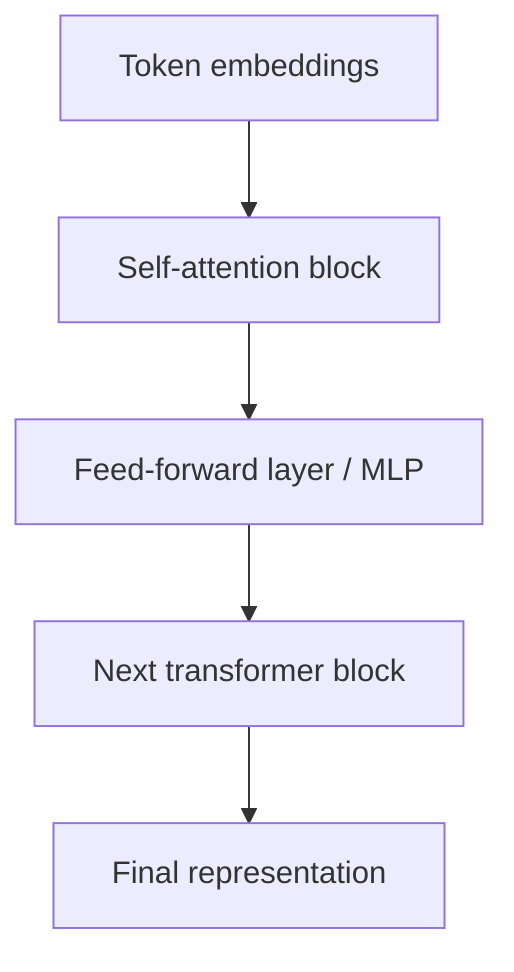

Transformers process sequences in parallel, unlike RNNs which process step by step.

## 5.6 BERT

BERT stands for Bidirectional Encoder Representations from Transformers. It is an encoder-only transformer model used for language understanding. It is pre-trained on large unlabeled text and fine-tuned for tasks like:
- question answering;
- sentiment analysis;
- named entity recognition.

Important terms:
- CLS token;
- SEP token;
- segment encoding;
- masked language modeling;
- next sentence prediction.

## 5.7 Deep Learning in NLP and Text Classification

Text classification means assigning text to a category, such as sentiment class or topic class.

Deep learning helps NLP because it learns semantic and contextual features from text automatically.

Models commonly used from the syllabus/decks:
- RNN for sequence processing;
- LSTM for long-term dependencies;
- GRU for efficient sequence learning;
- encoder-decoder for sequence-to-sequence tasks;
- transformers/BERT for contextual understanding.

---

# 6. Object Detection

## 6.1 Classification vs Localization vs Detection

| Task | Output |
|---|---|
| Image classification | Class label for whole image |
| Object localization | Class label + one bounding box |
| Object detection | Multiple objects + multiple bounding boxes + classes |

Object detection output:

```text
Y = [Pc, bx, by, bh, bw, c1, c2, c3]
```

Where:
- `Pc`: object probability;
- `bx`, `by`: center of bounding box;
- `bh`, `bw`: height and width;
- `c1, c2, c3`: class probabilities.

## 6.2 Sliding Window Algorithm

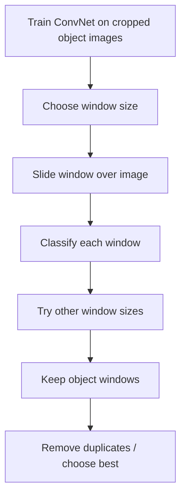

Drawback: the window may not exactly match the object, and checking many windows is computationally expensive.

## 6.3 IoU

IoU measures overlap between predicted and actual bounding boxes.

```text
IoU = area of intersection / area of union
```

Higher IoU means better bounding-box accuracy.

## 6.4 Non-Max Suppression

Non-max suppression removes duplicate overlapping predictions by keeping the box with highest confidence and suppressing lower-confidence overlapping boxes.

## 6.5 Anchor Boxes

Anchor boxes allow one grid cell to detect multiple objects or objects with different shapes.

For two anchor boxes:

```text
Y = [Pc,bx,by,bh,bw,c1,c2,c3, Pc,bx,by,bh,bw,c1,c2,c3]
```

Each object is assigned to the grid cell containing its midpoint and the anchor box with highest IoU.

## 6.6 Detection Models

| Type | Method | Examples |
|---|---|---|
| Single-stage | Directly predicts boxes and classes | YOLO, CornerNet, CenterNet |
| Two-stage | Region proposal, then classification/regression | R-CNN, Fast R-CNN, Faster R-CNN, Mask R-CNN |

### R-CNN Family

| Model | Key idea | Limitation |
|---|---|---|
| R-CNN | Selective search + CNN features + classifier | Very slow |
| Fast R-CNN | Shared CNN + RoI pooling | Still depends on region proposals |
| Faster R-CNN | Region Proposal Network from CNN features | More accurate but time-consuming |

### YOLO

YOLO divides the image into grids and predicts bounding boxes and class probabilities for each grid cell. It is a single-stage detector.

---

# 7. GAN

GAN has two parts:
- generator;
- discriminator.

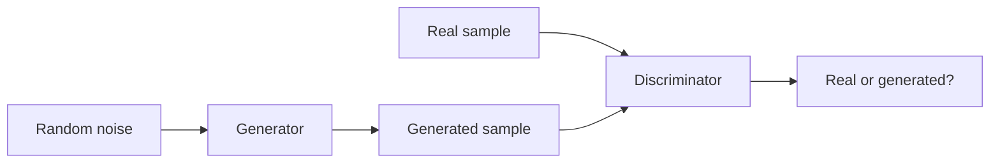

## Generator vs Discriminator Training

| Component | Training goal |
|---|---|
| Generator | Produce samples that fool discriminator |
| Discriminator | Correctly identify real vs generated samples |

The discriminator improves by learning to separate real data from generated data. The generator improves by learning to create outputs that the discriminator classifies as real.

Exam sentence:
GAN training is adversarial because the generator and discriminator have opposite goals, and both improve through competition.

---

# 8. Solved Numericals

## 8.1 Dropout Numerical

Question: A layer has 100 neurons. Dropout rate is 0.3. How many neurons are active in each forward pass?

```text
Dropout rate = 0.3
Dropped neurons = 100 * 0.3 = 30
Active neurons = 100 - 30 = 70
```

Answer: `70 neurons`.

## 8.2 Sigmoid Neuron Numerical

Question: `x = 0.9`, `w = -0.6`, `b = 0.2`, sigmoid activation. Compute weighted sum and output. Then change `w = -0.3`.

Case 1:

```text
z = wx + b
z = (-0.6)(0.9) + 0.2
z = -0.54 + 0.2 = -0.34

a = 1 / (1 + e^-z)
a = 1 / (1 + e^0.34)
a = 0.4158
```

Case 2:

```text
z = (-0.3)(0.9) + 0.2
z = -0.27 + 0.2 = -0.07

a = sigmoid(-0.07) = 0.4825
```

Conclusion: When weight increases from `-0.6` to `-0.3`, output increases from about `0.416` to `0.483`.

## 8.3 Learning Rate Numerical

Question: Initial weight `w = 0.4`, gradient `dE/dw = -0.1`. Compare learning rates `eta1 = 0.01` and `eta2 = 0.1`.

Update rule:

```text
w_new = w - eta * gradient
```

For `eta = 0.01`:

```text
w_new = 0.4 - 0.01(-0.1)
w_new = 0.401
```

For `eta = 0.1`:

```text
w_new = 0.4 - 0.1(-0.1)
w_new = 0.41
```

Answer: `eta = 0.1` gives faster weight update because it produces a larger change.

## 8.4 Logistic Regression One-Step Update

Given:

```text
x = [1, 2]
w = [0.1, -0.2]
b = 0
y = 1
alpha = 0.1
```

Forward:

```text
z = 0.1(1) + (-0.2)(2) + 0 = -0.3
a = sigmoid(-0.3) = 0.4256
```

Backward:

```text
dz = a - y = -0.5744
dw1 = dz*x1 = -0.5744
dw2 = dz*x2 = -1.1488
db = -0.5744
```

Update:

```text
w1 = 0.1 - 0.1(-0.5744) = 0.1574
w2 = -0.2 - 0.1(-1.1488) = -0.0851
b = 0 - 0.1(-0.5744) = 0.0574
```

## 8.5 CNN Numerical from 2023-24 Paper

Given:

```text
Input = 28 x 28 x 1
Conv1: k=16, f=5, s=1, p=2
Pool1: f=2, s=2
Conv2: k=32, f=5, s=1, p=2
Pool2: f=2, s=2
Classes = 10
```

| Layer | Calculation | Output shape | Parameters |
|---|---|---:|---:|
| Conv1 | `(28+4-5)/1 + 1 = 28` | `28 x 28 x 16` | `(5*5*1+1)*16 = 416` |
| Pool1 | `(28-2)/2 + 1 = 14` | `14 x 14 x 16` | 0 |
| Conv2 | `(14+4-5)/1 + 1 = 14` | `14 x 14 x 32` | `(5*5*16+1)*32 = 12,832` |
| Pool2 | `(14-2)/2 + 1 = 7` | `7 x 7 x 32` | 0 |
| Flatten | `7*7*32` | `1568` | 0 |
| FC | `1568 -> 10` | `10` | `(1568+1)*10 = 15,690` |

Total parameters including FC:

```text
416 + 12,832 + 15,690 = 28,938
```

## 8.6 CNN Numerical from 2024-25 Paper

Given:

```text
Input = 32 x 32 x 3 color image
Conv1: k=6, f=5, s=1, p=0
Pool1: f=2, s=2
Conv2: k=10, f=5, s=1, p=0
Pool2: f=2, s=2
Classes = 10
```

Formula:

```text
Output size = floor((n + 2p - f)/s) + 1
```

| Layer | Calculation | Output shape | Parameters |
|---|---|---:|---:|
| Conv1 | `(32+0-5)/1 + 1 = 28` | `28 x 28 x 6` | `(5*5*3+1)*6 = 456` |
| Pool1 | `(28-2)/2 + 1 = 14` | `14 x 14 x 6` | 0 |
| Conv2 | `(14+0-5)/1 + 1 = 10` | `10 x 10 x 10` | `(5*5*6+1)*10 = 1,510` |
| Pool2 | `(10-2)/2 + 1 = 5` | `5 x 5 x 10` | 0 |
| Flatten | `5*5*10` | `250` | 0 |
| FC | `250 -> 10` | `10` | `(250+1)*10 = 2,510` |

Total parameters including FC:

```text
456 + 1,510 + 2,510 = 4,476
```

The question specifically asks to mention FC parameters:

```text
FC parameters = 2,510
```

## 8.7 RNN Forward Numerical

Given:

```text
W_xh = 0.5
W_hh = 0.2
h0 = 0
x1 = 1
x2 = 2
W_hy = 1
```

Use:

```text
h_t = tanh(W_xh*x_t + W_hh*h_(t-1))
y_t = sigmoid(W_hy*h_t)
```

At `t=1`:

```text
h1 = tanh(0.5*1 + 0.2*0) = tanh(0.5) = 0.4621
y1 = sigmoid(0.4621) = 0.6135
```

At `t=2`:

```text
h2 = tanh(0.5*2 + 0.2*0.4621)
h2 = tanh(1.0924) = 0.7978
y2 = sigmoid(0.7978) = 0.6895
```

## 8.8 LSTM Gate Numerical

Given:

```text
C(t-1) = 0.4
f_t = 0.8
i_t = 0.6
C~_t = 0.5
o_t = 0.7
```

Cell state:

```text
C_t = f_t*C(t-1) + i_t*C~_t
C_t = 0.8(0.4) + 0.6(0.5)
C_t = 0.62
```

Hidden state:

```text
h_t = o_t*tanh(C_t)
h_t = 0.7*tanh(0.62)
h_t = 0.386
```

## 8.9 Attention Numerical: Single Key-Value

Given:

```text
Q = [2,1], K = [1,3], V = [4,2], d_k = 2
```

```text
Q.K = 2(1) + 1(3) = 5
score = 5 / sqrt(2) = 3.536
```

Since there is only one value vector:

```text
attention output = [4,2]
```

## 8.10 Attention Numerical: Multiple Keys

Given:

```text
Q = [2,1]
K1 = [1,0], K2 = [0,2], K3 = [1,1]
V1 = [3,1], V2 = [2,4], V3 = [5,2]
d_k = 2
```

Scores:

```text
s1 = 2/sqrt(2) = 1.414
s2 = 2/sqrt(2) = 1.414
s3 = 3/sqrt(2) = 2.121
```

Softmax weights:

```text
w1 = 0.248
w2 = 0.248
w3 = 0.503
```

Output:

```text
0.248[3,1] + 0.248[2,4] + 0.503[5,2]
= [3.76, 2.248]
```

---

# 9. Exam-Ready Long Answers

## 9.1 Compare GD, SGD, and Mini-Batch GD

Gradient descent updates parameters to minimize loss. In batch gradient descent, gradients are calculated using the entire training set, so updates are stable but slow. In stochastic gradient descent, gradients are calculated using one training example at a time, so updates are faster but noisy. Mini-batch gradient descent uses a small batch of examples, giving a balance between stability and speed. Mini-batch GD is widely used in deep learning because large datasets make full-batch training expensive.

## 9.2 Explain Batch Normalization

Batch normalization is a technique that normalizes activations of a layer within a mini-batch. It calculates batch mean and variance, normalizes the activation values, and then applies learnable scale and shift using gamma and beta. It reduces internal covariate shift, stabilizes activation distributions, improves gradient flow, reduces sensitivity to initialization, and speeds up training.

## 9.3 Explain Transfer Learning with Example

Transfer learning means using knowledge learned by a model on one task for another related task. A pre-trained image model may already know edges, textures, shapes, and object parts. For a new classification task, we can keep earlier feature-extraction layers, replace the final classifier, train the new classifier, and optionally fine-tune some layers with a smaller learning rate. Benefits include reduced training time, less data requirement, lower computational cost, and better performance when the new dataset is small.

## 9.4 Explain Attention Long-Range Dependency

Traditional RNNs process tokens step by step, so information from early tokens may weaken over long sequences. Transformers use self-attention, where each token can directly compare itself with every other token through attention scores. This direct connection helps capture long-range dependencies. For example, in a long sentence, a word near the end can attend to a related word near the beginning without passing through many recurrent steps.

## 9.5 Explain Sliding Window Object Detection

Sliding window detection trains a ConvNet on cropped object images. During detection, a window of fixed size is moved across the image. Each window is passed through the ConvNet to decide whether it contains the object. The process is repeated for different window sizes. The detected boxes are stored, and overlapping boxes can be filtered by keeping the highest-confidence one. Its drawback is poor localization accuracy and high computation.

## 9.6 Explain Generator and Discriminator Training

In GAN, the generator creates fake samples from random noise. The discriminator receives both real and generated samples and predicts whether each is real or fake. The discriminator is trained to correctly classify real and generated samples. The generator is trained to fool the discriminator into classifying generated samples as real. Thus, both models improve through adversarial training.

---

# 10. Practice Bank Based on Both Papers

## 2-Mark Practice

1. In what way is logistic regression a simplified neural network?
2. If dropout rate is `0.3` and a layer has 100 neurons, how many are active?
3. Define internal covariate shift.
4. What is the role of gamma and beta in batch normalization?
5. Define stride in CNN.
6. Define padding in CNN.
7. What is depth in CNN?
8. What is transfer learning?
9. What is an identity shortcut in ResNet?
10. Is residual-block addition element-wise addition or concatenation?
11. What is object detection?
12. How does object detection differ from image classification?
13. What are anchor boxes?
14. What is IoU?
15. Name two applications of RNN.
16. What is the role of encoder in encoder-decoder architecture?
17. What is the role of decoder in encoder-decoder architecture?
18. What are Q, K, and V in attention?
19. What is BERT?
20. Name deep learning models used in NLP text classification.

## 4-Mark Practice

1. A model has 99% training accuracy and 75% testing accuracy. Which hyperparameter tuning techniques can help?
2. Explain batch normalization and how it improves performance.
3. Explain transfer learning with benefits.
4. Compare L1 and L2 regularization.
5. Explain how dropout differs from L1 and L2 regularization.
6. Explain encoder-decoder architecture for sequence-to-sequence tasks.
7. Explain GAN generator and discriminator training.
8. Explain how attention captures long-range dependencies.
9. Explain object detection and sliding-window algorithm.
10. How do you know a model is suffering from exploding gradients?

## 6-Mark Practice

1. Compare gradient descent, stochastic gradient descent, and mini-batch gradient descent.
2. Analyze why Adam may converge faster than SGD.
3. Calculate a CNN architecture for a 32x32 color image with given layers.
4. Explain logistic regression as a neural network with formula and diagram.
5. Explain LSTM architecture with gates.
6. Illustrate RNN architecture with applications and gradient problems.
7. Explain CNN layers and calculate output shapes.
8. Explain ResNet skip connection and its role in training deeper networks.

## Numerical Practice

1. `x=0.9`, `w=-0.6`, `b=0.2`. Compute sigmoid output. Repeat for `w=-0.3`.
2. `w=0.4`, gradient `=-0.1`. Compute updated weights for learning rates `0.01` and `0.1`.
3. Input `32 x 32 x 3`, Conv1 `k=6, f=5, s=1, p=0`, Pool1 `f=2,s=2`, Conv2 `k=10, f=5, s=1,p=0`, Pool2 `f=2,s=2`. Calculate all shapes and FC parameters.
4. Input `28 x 28 x 1`, Conv1 `k=16, f=5, s=1,p=2`, Pool1, Conv2 `k=32,f=5,s=1,p=2`, Pool2. Calculate shapes and parameters.
5. Given `Q=[1,2]`, `K=[3,1]`, `V=[2,5]`, `d_k=2`, compute attention score and output.
6. Given LSTM gate values, calculate new cell state and hidden state.

---

# 11. One-Page Last-Minute Sheet

## Formula Box

```text
Neuron: z = wTx + b
Sigmoid: 1 / (1 + e^-z)
Loss: -[y log(a) + (1-y) log(1-a)]
Gradient update: w_new = w - eta*gradient
Dropout active neurons = total neurons * (1 - dropout rate)
CNN output = floor((n + 2p - f)/s) + 1
Conv params = (f*f*input_depth + 1) * filters
FC params = (input_units + 1) * output_units
RNN: h_t = activation(Wxh*x_t + Whh*h_(t-1) + b)
LSTM: C_t = f_t*C(t-1) + i_t*C~_t
Attention score = (Q.K) / sqrt(d_k)
IoU = intersection / union
```

## Most Repeated / Most Likely Topics

| Must Prepare | Why |
|---|---|
| CNN calculations | Appears in both papers |
| Optimizers | Strong focus in 2024-25 |
| Batch normalization | Appears directly in both |
| Logistic regression and sigmoid | Appears directly in both |
| Dropout and regularization | Numericals + theory |
| RNN/LSTM/gradient problems | Repeated sequence-model focus |
| Attention | Transformer question trend |
| Object detection/sliding window/anchors | Repeated final-unit area |
| Transfer learning | Appears in both |
| GAN | Appears in both |

## Diagram Checklist

Practice drawing:
- artificial neuron;
- logistic regression as shallow NN;
- forward/backward propagation;
- batch normalization flow;
- CNN pipeline;
- residual block;
- RNN unrolled through time;
- LSTM cell;
- encoder-decoder;
- transformer block;
- sliding-window object detection;
- anchor boxes and bounding box.

